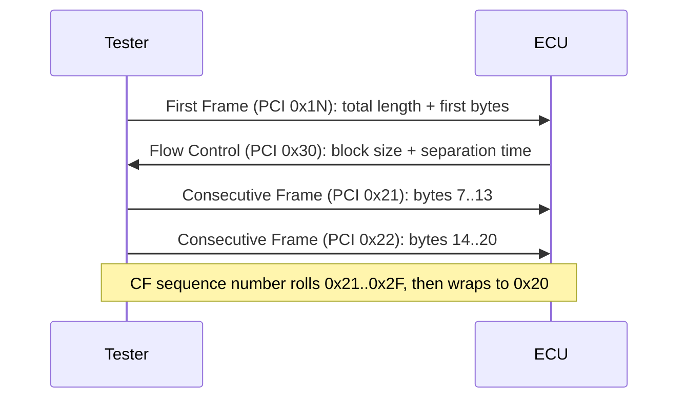

# UDS Exercise

This is the first hands-on diagnostic lab. It applies the concepts covered in
[Diagnosis](../../../diagnosis/index.md) — services, sessions, negative
responses, multi-frame transport — by building and debugging them directly.

**After this exercise you will be able to:**

- **write scripts that simulate an ECU answering UDS (Unified Diagnostic
  Services) requests** — byte for byte, response by response;
- **read real request/response traces line by line and identify the errors
  planted in them**, the same skill used when a diagnostic test fails for an
  unknown reason.

## Goal

- Build the request/response pairs for the core UDS services by hand:
  `ReadDataByIdentifier` (0x22), `WriteDataByIdentifier` (0x2E),
  `ReadDTCInformation` (0x19), `RoutineControl` (0x31) and
  `DiagnosticSessionControl` (0x10).
- Apply the diagnostic session rules while doing it.
- Explain multi-frame (ISO-TP) transfers with consecutive frames.
- Analyze complete traces — including a full `SecurityAccess` (0x27) seed &
  key sequence — and identify protocol-level mistakes.

## What you need to remember

Before starting the exercise, review these three building blocks; they are
sufficient for the whole exercise.

### UDS message anatomy

Every diagnostic exchange involves exactly two roles: a request from the
**tester** (via CANalyzer) and a reply from the **ECU**.

- A request starts with the **Service Identifier (SID)** — one byte saying
  *what* you want.
- A **positive response** echoes `SID + 0x40` (e.g. `22` → `62`). If you see
  the +0x40 echo, the ECU understood and complied.
- A **negative response** is always exactly three bytes: `7F <SID> <NRC>`,
  where NRC is the Negative Response Code telling you *why* the request was
  refused.

The NRCs below are the ones used in this exercise and appear throughout the
traces in Part 2:

| NRC | Name | When you see it |
|---|---|---|
| 0x13 | incorrectMessageLengthOrInvalidFormat | Wrong number of bytes in the request |
| 0x24 | requestSequenceError | Steps executed in the wrong order |
| 0x31 | requestOutOfRange | Unknown DID/RID or bad parameter value |
| 0x33 | securityAccessDenied | Service locked behind SecurityAccess |
| 0x35 | invalidKey | Wrong key sent during SecurityAccess |
| 0x7F | serviceNotSupportedInActiveSession | Service not allowed in the current session |

### Session control rules

ECUs have **diagnostic sessions**, which act as permission levels. The
exercise sheet fixes these transition rules (footnote (1) of the sheet), and
your simulated ECU must enforce them:

```mermaid
stateDiagram-v2
    [*] --> Default
    Default --> Extended: 10 03
    Extended --> Programming: 10 02
    Extended --> Default: 10 01
    Programming --> Default: 10 01
    note right of Programming
        Reachable only from Extended,
        never directly from Default
    end note
```

- Default → Extended is allowed; **Programming is reachable only from
  Extended**.
- **Default can always be reached**, from any session. It is the safe
  fallback.

### Multi-frame messages (ISO-TP)

A single CAN frame carries at most 7 bytes of diagnostic payload. When a
message is longer, **ISO-TP** (the transport layer, ISO 15765-2) splits it
into multiple frames:



The high nibble of the first byte identifies the frame type: `0` = single
frame, `1` = first frame, `2` = consecutive frame, `3` = flow control. Refer
to this classification whenever a trace spans more than one CAN frame.

## Setup

The exercise uses the toolchain from the earlier MIL2 lessons, applied to
diagnostics:

- **CANalyzer** (or CANoe) with a diagnostic-capable configuration — the same
  environment used in the [CANalyzer](../../../canalyzer/index.md) lessons.
- The diagnostic description **CDD file** for the target ECU
  (`D2956_IPC_E2A_R10_332BEV.cdd` — the instrument panel cluster of the 332
  BEV platform), loaded into the configuration so requests are interpreted as
  services and DIDs instead of raw bytes.
- A **CAPL script** implementing a simulated ECU node (the
  [CAPL](../../../capl/index.md) lessons cover the language): on each incoming
  diagnostic request the script builds and sends the required response. This
  simulated ECU is the core of Part 1.

## Part 1 — Build the conversations

Write the script (and the byte sequences it exchanges) for each scenario.
Each scenario adds one new UDS service.

**1. Read vehicle speed from DID `AA AA`.**
The tester sends a `ReadDataByIdentifier` for the DID, the ECU answers
positively with the speed set to 100 km/h:

| Direction | Bytes | Meaning |
|---|---|---|
| Tx | `22 AA AA` | Read DID 0xAAAA |
| Rx | `62 AA AA 64` | Positive response; 0x64 = 100 km/h (1 km/h per unit) |

**2. Write `XX XX` to DID `BB BB` — allowed only in the Extended session.**
The session rules apply here: the session must be changed first, otherwise
the ECU should reject the write with NRC 0x7F
(serviceNotSupportedInActiveSession):

| Direction | Bytes | Meaning |
|---|---|---|
| Tx | `10 03` | Switch to Extended session |
| Rx | `50 03` | Session changed |
| Tx | `2E BB BB XX XX` | Write DID 0xBBBB |
| Rx | `6E BB BB` | Positive response echoes SID+0x40 and the DID |

**3. Ask how many DTCs are stored.**
Use `ReadDTCInformation` with subfunction 0x01
(reportNumberOfDTCByStatusMask) and a status mask of `FF` (any status). The
positive response carries the availability mask, the DTC format and the
2-byte count — here, 4 DTCs:

| Direction | Bytes | Meaning |
|---|---|---|
| Tx | `19 01 FF` | Count DTCs matching any status |
| Rx | `59 01 FF 01 00 04` | Mask FF, format 0x01, count = 0x0004 (4 DTCs) |

**4. Start routine `CC CC` — expect a negative response for wrong length.**
Send a malformed `RoutineControl` start request (e.g. missing routine control
option bytes) and answer with NRC 0x13. Building the failure case
deliberately is part of the exercise:

| Direction | Bytes | Meaning |
|---|---|---|
| Tx | `31 01 CC CC` | startRoutine, RID 0xCCCC, length not as expected |
| Rx | `7F 31 13` | incorrectMessageLengthOrInvalidFormat |

**5. Explain consecutive frames.**
Give an example where a response longer than 7 bytes is split: the ECU sends
a First Frame announcing the total length, the tester returns a Flow Control,
and the remaining bytes travel in Consecutive Frames numbered 0x21, 0x22, …
(see the ISO-TP diagram above).

## Part 2 — Read the traces, find the mistakes

Each trace below is printed exactly as given in the exercise; some contain
deliberate errors. For every line, state what it means, then decide whether
it is correct; if not, state what the bytes should have been.

### Trace 1 — read, write, read again

| Dir | Bytes |
|---|---|
| Tx | `22 F1 AB` |
| Rx | `62 F1 AB 04` |
| Tx | `2E F1 AB 07` |
| Rx | `6E F1 AB` |
| Tx | `22 F1 AB` |
| Rx | `62 F1 AB 04` |

What to check: the ECU stores DID 0xF1AB = 0x04, the tester overwrites it
with 0x07 and reads it back. Is the final response consistent with the write
that just succeeded?

### Trace 2 — a refused read

| Dir | Bytes |
|---|---|
| Tx | `22 F1 8` |
| Rx | `7F 22 33` |

What to check: NRC 0x33 means securityAccessDenied — but first look at the
request itself: a DID is always **two** bytes. Is the request even well
formed, and would 0x33 (or rather 0x13) be the right refusal?

### Trace 3 — SecurityAccess seed & key

| Dir | Bytes |
|---|---|
| Tx | `22 AA AA` |
| Rx | `7F 22 24 33` |
| Tx | `27 11` |
| Rx | `67 12 SS SS SS SS` |
| Tx | `27 12 KK KK KK KK` |
| Rx | `7F 27 35` |
| Tx | `27 11 SS SS SS SS` |
| Rx | `67 11 SS SS SS SS` |
| Tx | `27 12 KK KK KK KK` |
| Rx | `27 11` |
| Tx | `67 11 00 00 00 00` |
| Rx | `22 AA AA` |
| Tx | `62 AA AA XX` |

This trace contains several planted errors. The correct seed & key flow is a
strict four-step handshake:

1. Tester requests the seed: `27 <odd subfunction>`, e.g. `27 11` — **no
   extra data bytes**.
2. ECU replies `67 <same subfunction> <seed>`.
3. Tester computes the key and sends it: `27 <subfunction+1> <key>`.
4. ECU validates and replies `67 <subfunction+1>`; on a wrong key it answers
   `7F 27 35` (invalidKey).

Compare the trace against this flow and check at least:

- the negative response after the first read (how many NRC bytes are there?),
- the subfunction echoed in the first seed response (`67 12` after a `27 11`
  request?),
- the second seed request, which carries unexpected payload bytes,
- the reply to the second key attempt — whether a request is ever answered by
  another request,
- the last three lines: which lines are sent by the tester and which by the
  ECU.

### Trace 4 — session control

| Dir | Bytes |
|---|---|
| Tx | `10 01` |
| Rx | `50 01` |
| Tx | `10 03` |
| Rx | `50 03` |

What to check: against the session rules (Default is always reachable;
Extended from Default; Programming only from Extended), is this sequence
legal?

When the analysis is complete, write up the findings and send the report to
automotive.training@kineton.it or directly to your mentor; explaining the
reasoning is part of the exercise.

## Common mistakes

The following mistakes occur frequently on a first attempt:

- Forgetting the **session precondition**: writing a DID that requires the
  Extended session while still in Default — the ECU must answer `7F 2E 7F`.
- Mixing up the subfunction echo in SecurityAccess: `requestSeed` uses the
  odd level (0x11), `sendKey` uses level+1 (0x12), and the positive response
  must echo the **same** subfunction as the request.
- Negative responses with more or fewer than three bytes — the format is
  fixed: `7F <SID> <NRC>`.
- Role confusion in traces: requests (0x22, 0x27, 0x10…) come from the
  tester, responses (0x62, 0x67, 0x50, 0x7F…) from the ECU. Any line breaking
  that is an error.
- Miscounting DID length: a DID is two bytes, so `22 F1 8` is not a valid
  request.
- Consecutive-frame numbering errors: CF sequence numbers start at 0x21 and
  wrap after 0x2F back to 0x20.

!!! success "Key takeaways"
    - Positive responses echo SID + 0x40; negative responses are always
      three bytes in the form `7F SID NRC`. The NRCs used in this exercise
      are 0x13, 0x33, 0x35 and 0x7F.
    - Session rules: Programming is reachable only from Extended, Default is
      reachable from any session, and services can be refused per session.
    - The SecurityAccess handshake consists of requestSeed (odd level)
      followed by sendKey (level+1), with responses echoing the request's
      subfunction.
    - Payloads longer than 7 bytes are transferred over ISO-TP as a First
      Frame, a Flow Control, and Consecutive Frames numbered 0x21…0x2F.
    - Trace analysis proceeds byte by byte — direction, SID, subfunction,
      length, consistency — to identify planted protocol errors.

---

## Source material

This article was distilled from the academy lesson materials:

- :material-file-pdf-box: [UDS Exercise](../../../../assets/mil2/18_RDI_Testing/18_RDI_Testing/UDS_Exercise/UDS_Exercise.pdf) — PDF, 104.6 KB

## Downloads

- :material-file: [D2956 IPC E2A R10 332BEV](../../../../assets/mil2/18_RDI_Testing/18_RDI_Testing/UDS_Exercise/D2956_IPC_E2A_R10_332BEV.cdd) — 2.6 MB
