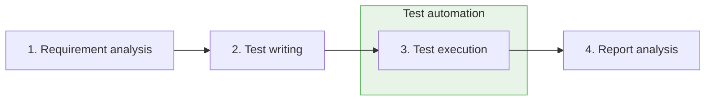
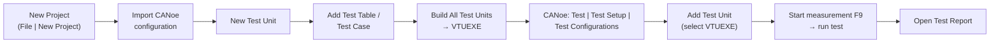
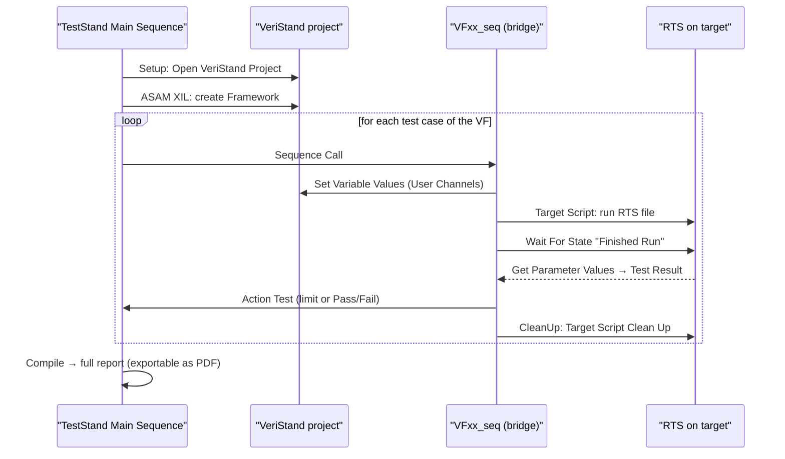

# Test Automation

Manual validation does not scale: a vehicle function can have dozens of test
cases, each to be re-executed at every software release, often on a HIL bench
that sits idle at night. **Test automation** replaces the repetitive human part
of validation with tools, scripts and software that replay pre-defined actions
against the unit under test (UUT) — in our context, an ECU or a whole vehicle
function — and produce a report with the verdict and, on failure, the cause.

This lesson surveys the automation toolchains used in the bootcamp:

- **CANoe + CAPL** — test modules scripted in a C-like language, inside the
  Vector environment you already know
- **Vector vTESTstudio** — a dedicated authoring environment with tabular,
  graphical and programming notations, executed through CANoe
- **TraceTronic ECU-TEST** — a drag-and-drop tool that orchestrates the whole
  test environment without programming skills
- **NI VeriStand Stimulus Profile Editor + NI TestStand** — real-time
  sequences on a NI HIL target, composed into automated campaigns

## Why automate

A manual validation cycle has four steps: requirement analysis, test writing,
test execution, report analysis. Automation takes over step 3 — and partly
step 4, since the report is generated by the tool:

The benefits compound over a project lifetime:

| Property | What it means in practice |
|---|---|
| Efficient | A huge number of tests can run in 24 hours |
| Flexible | Tests run unattended, even at night |
| Fast | Execution is much faster than a human operator |
| Repeatable | The identical test set re-runs at every software release |
| Reliable | No human-generated errors in execution and data logging |
| Versatile | Tests already written are reused in new projects |

!!! warning "Automation is not free"
    The two real limitations are the **initial investment** (licenses, bench
    setup, writing and debugging the automated tests) and the fact that it is
    **not applicable to all tests** — subjective evaluations, exploratory
    testing and one-off checks still need a human. Weigh the investment
    against how many times the test set will be re-executed.

On the plus side, automation also removes people from **dangerous tests** and
**hard environmental conditions**, and the **automatic reports** largely
dispose of a separate bug-tracking phase: the output highlights not just the
result but, on failure, the cause of the negative verdict.

### Automation levels

Not every project automates the same share of the workflow:

- **Level 1** — only a part of the tests is automated.
- **Level 2** — all tests are automated; the other validation steps
  (requirement analysis, test writing, report review) stay manual.
- **Level 3** — all tests automated, and the other validation steps automated
  too (e.g. report generation and distribution, campaign scheduling).

## CANoe + CAPL

The first automation approach builds directly on the
[CANoe](../canoe/index.md) environment and the
[CAPL](../capl/index.md) language from the previous lessons.

CANoe can simulate entire networks from the communication database (DBC): the
rest-bus nodes exist in simulation, their **signal values are editable**, but
the *signal logic* of the real ECU software is not simulated — the simulated
nodes only send what you tell them to send. That is enough to stimulate an ECU
under test and observe its reactions.

Two CAPL-based building blocks turn this into automated testing:

- **Network nodes** — CAPL programs attached to simulation nodes. They can
  emulate ECU software behavior, drive panels, control HIL hardware, and
  simulate whole networks.
- **CAPL test modules** — CAPL programs structured as test cases: they
  stimulate signals, wait for conditions, check responses, and log verdicts.
  CANoe collects the outcome of every test module into a **test report**.

!!! note "When CAPL test modules are the right choice"
    CAPL gives total flexibility — anything you can express in C-like code can
    be a test — but the programming effort grows with test complexity, the
    report content must be customized inside each test's code, and the tests
    are fragile against database or interface changes. For large, long-lived
    test sets, a dedicated authoring tool (vTESTstudio, ECU-TEST) is usually
    more maintainable.

## vTESTstudio

**vTESTstudio** is Vector's development environment for automated ECU tests.
Its distinguishing feature is that it offers **three notations** for the same
test, freely mixed within a project:

| Notation | Editor | Best for |
|---|---|---|
| Table-based | Test Table Editor | Classic step-by-step test cases (stimulate → wait → check) |
| Graphical | Test Sequence Diagram, State Diagram | Reviews, coverage-driven test generation |
| Programming-based | Programming Editor | Complex logic, CAPL-like full control |

### Project setup and the build–run pipeline

vTESTstudio does not execute tests by itself: it **compiles** them and hands
them to CANoe. The end-to-end flow is:

In detail:

1. **Create the project** — *File | New Project*, choose path and name. To
   share naming and variables with the bus setup, open CANoe, load your
   configuration and **import that configuration into vTESTstudio** before
   writing any test.
2. **Create a Test Unit** — open the Project View (*Layout | Views | Project
   View*), right-click the project, *New Test Unit*. A test unit is the
   container that will later be compiled and attached to CANoe.
3. **Add a Test Table** — right-click the test unit, *Add | Test Table*.
4. **Create a Test Case** — select the test table, click *Command…*, type
   `test`: the autocomplete input assistance opens; select *Test Case* and
   press *Enter*. The test case appears in the Test Tree.
5. **Build** — *Home | Build All Test Units*. The Output window shows errors
   or warnings. A successful build generates an **executable test unit
   (`.VTUEXE`)** in the folder defined under *Project | Configuration… |
   Build*.
6. **Configure in CANoe** — open the CANoe configuration the system
   environment was imported from, go to *Test | Test Setup | Test
   Configurations*, add a test configuration, then use the *Add Test Unit*
   icon and select the VTUEXE file at its output path.
7. **Execute** — start the CANoe measurement with **F9**, click the *Start*
   icon to run the test, and when execution finishes click *Open Test Report*
   to inspect the result.

### Anatomy of a test case

A typical table-notation test case follows a fixed rhythm:

| Command | Role |
|---|---|
| Preparation | Establish the initial conditions |
| Set | Write a symbol (signal) from the DBC |
| Wait | Give the ECU time to react |
| Check | Verify a symbol after the set |
| Completion | Exit conditions, restore state |
| Await Value Match | Check that a symbol reaches a value before a timeout |

Two reuse mechanisms keep large test sets manageable:

- **Test Case Definitions** — for repetitive tests that differ only in signal
  values. From *Functions* add a *Test Case Definition*, give it a name and
  **parameters**, and write the test once with symbols bound to parameters.
  In the Test Tree you then create a *Test Sequence* that calls the definition
  several times, each time with a different parameter value.
- **Function Definitions** — for repeated *fragments* of test logic: define
  the commands once as a function and call it from any test case.

**System variables** (needed e.g. for values not on the bus) are created in
CANoe under *Environment*, added according to the DBC, and then associated to
the test.

### Graphical notations

The **Test Sequence Diagram** editor defines tests graphically — flows with
decisions, forks and joins — while tabular test code sits behind each
graphical element. The notation is particularly suitable for **reviews**, and
by default **one test case is generated for each path through the diagram**
(finer-grained control is possible).

The **State Diagram** editor goes further: you model the *expected behavior of
the system under test* as a state machine, and test cases are **generated
automatically from the model** based on transition coverage. Several
generation algorithms are supported, e.g. the **Chinese Postman** algorithm
and a breadth-search-based algorithm.

### Parameters and variants

Parameters are constant values accessible from the test sequence in any
implementation language; they are shown in the Symbol Explorer under the
*Parameters* tab. Four kinds exist:

| Kind | Contents | Typical use |
|---|---|---|
| Scalar parameter | one constant value | a fixed threshold |
| Scalar list parameter | 1…n values for one variable | iterate the same test over several temperatures |
| Struct parameter | a set of associated scalar values | one test vector (stimulus + expected values) |
| Struct list parameter | a list of value tuples | iterate over many test vectors |

**Variants** handle ECU and test diversity through *variant properties*: they
drive conditional test coding, give access to variant-dependent parameter
values, and define variant-dependent test cases or test groups. Properties are
transferred into the test code from the Symbol Explorer or via text
completion.

!!! tip "vTESTstudio vs. raw CAPL"
    Same CANoe underneath, but the test code is drag-and-drop over pre-defined
    commands, the generated report is rich in detail without extra coding, and
    parameter/variant handling makes tests robust against changes — provided
    you actually use those features.

## ECU-TEST

**ECU-TEST** (by TraceTronic) is a standard tool in automotive ECU development
that automates the control of the **whole test environment**, not just the bus
simulation. Its declared characteristics:

- supports a broad range of test tools (CANoe, HIL benches, measurement and
  calibration hardware, …),
- facilitates each validation step, from design to report analysis,
- is based on user-friendly commands and interfaces,
- **requires no programming skills**,
- allows shared libraries of reusable test building blocks.

### Where it sits in the V-cycle

ECU-TEST test cases are designed once from the requirement and then executed
unchanged at every integration level — model, code, ECU, vehicle:

This is the practical answer to "what changes if the test environment
changes?": the test cases don't — only the configuration that binds them to
the bench does.

### Architecture: project, packages, TCF and TBC

- **Project (.prj)** — the top-level container, holding **packages (.pkg)**
  with the test cases (sequences of test steps, possibly nested in
  subpackages), **signal recordings** and **trace analyses** (trace steps).
  Execution produces the **test report (.trf)**.
- **Ports** connect the test cases to the system under test through generic
  interfaces — this is the **independence from the environment**: test cases
  reference ports, not concrete hardware.
- **Test Configuration (TCF)** — declares what is being tested and with what
  data: the systems under test, the applied simulation models, the A2L and
  database files, and report/execution settings.
- **Test Bench Configuration (TBC)** — describes the concrete bench: which
  tools are connected and how each port maps onto them.

Because ports are bound to tools in the TBC rather than in the test cases, the
same package runs on a MIL model, a HIL rig or the vehicle by swapping
configurations. A typical test structure runs: setup → stimulation and
evaluation steps (with trace analysis of recorded signals) → execution →
report analysis on the generated `.trf`.

## NI VeriStand: Stimulus Profile Editor and TestStand

The fourth toolchain automates tests on a **NI HIL** bench. Two ingredients
are needed up front: a **UUT** (the control unit under test) and a
**framework** — the coded structure that interacts with the UUT automatically,
which here includes the VeriStand project the sequences operate on. The
automation output is a report highlighting the result and, on failure, the
cause of the negative validation.

### Real-Time Sequences with the Stimulus Profile Editor

The authoring tool is the **Stimulus Profile Editor**, an NI VeriStand
component that looks like a standard IDE (Code::Blocks, Xcode) but manipulates
the parameters of the current VeriStand project. To start it: launch
VeriStand, open the project, then use the **Tool Launcher** and open the
*Stimulus Profile Editor* window.

The core construct is the **Real-Time Sequence (RTS)**: the translation into
code of a *single test case* — the maneuvers the tester would perform by hand
in one test. Recurring maneuver sequences (e.g. emulating a moving vehicle)
are factored out into **libraries** that test cases recall; library syntax is
identical to test case syntax.

The editor's panels:

| Panel | Contents |
|---|---|
| Code | the sequence syntax |
| Primitives | Variables; Expressions (assignments); Structures — loops (`while`, `do while`, `for`), conditionals (`if/else`), **Multitasking** for parallel instructions with independent stop; Advanced — suspend the sequence while the real-time primary control loop iterates; Miscellaneous — documentation, state lists |
| Quantities | **Return Variable** (the sequence output: Boolean for OK/KO, or double for a numeric result), **Parameters** (inputs), **Local Variables**, **Channel References** (links to project quantities: aliases, CAN signals, software variables, analog/digital signals) |
| References | all real-time sequences called by the selected one |
| Output | errors and warnings from compilation |

To execute a sequence: **compile** it, fix any errors/warnings, open the
project screen (a simplified vehicle–driver interface showing the project
parameters involved), invoke the RTS control from the left menu, and press
**Play**. When the sequence finishes, the result is the Return Variable value
— `true`/`false` for a Boolean, or the numeric output for a double.

!!! note "Validate the automation before trusting it"
    Run the manual test and the automated sequence on the same condition and
    check the results are consistent. Only then is the test case automated
    properly.

### Automating a whole Vehicle Function

A VF's test set is a collection of RTS files. Two ways run them as an
unattended campaign.

**Option 1 — Stimulus Profile.** The profile first recalls the VeriStand
project through *VeriStand Control* (open/close and actively control the
project), then invokes each RTS with a **Real-Time Sequence Call**, where you
define:

- the **file path** of the sequence and the **target name** — the target's
  full specification: operating system, IP address, processor tasks, the data
  processing loop, execution mode (Low Latency or Parallel), DAQ and DIO
  frequency rates, warmup time, **target rate (Hz)** and **timing source
  timeout (ms)**;
- the **Pass/Fail evaluation**: *Boolean*, *Always Pass*, or
  *NumericBoundsCheck* against a predefined threshold;
- optionally **Update Parameters**, to modify the inputs and study the UUT's
  reaction.

After compilation and launch, the run generates a report listing the result of
each Real-Time Sequence.

**Option 2 — NI TestStand.** TestStand is a separate NI product; here it is
used not to write sequences in Python, C++ or LabVIEW, but to **invoke the RTS
files already written** in the Stimulus Profile Editor — it replaces the
stimulus profile as the campaign container.

The procedure in detail:

1. **Main Sequence, Setup section** — open the project: left path *NI
   VeriStand → Open VeriStand Project*; then, under *ASAM XIL*, select the
   **Framework** item to create the framework based on the open VeriStand
   project.
2. **Bridge sequence `VFxx_seq`** — one per test case:
   - declare the **Test Result** variable;
   - in *Setup*, call **Set Variable Values** to set the parameters defined as
     *User Channels* in the VeriStand project's System Definition File;
   - in *Main*, create the **Target Script** from the left menu and define the
     project path and the RTS file created in the Stimulus Profile Editor;
   - call **Target Script Wait For State** to align with the RTS's *Finished
     Run* condition, followed by a Wait as synchronization time buffering;
   - call **Target Script Get Parameter Values** to read back the local
     *Test Result*;
   - use **Action Test** to select the verdict mode (numeric *Limit Test* or
     *Pass/Fail*);
   - in *CleanUp*, call **Target Script Clean Up** to clear the target script
     and return to initial conditions.
3. **Main Sequence, Main section** — recall the `VFxx` sequences in cascade
   via **Sequence Call**: as many sequence calls as the VF has test cases.
   Compiling produces the complete report, exportable as a PDF.

## Choosing a tool

| | CAPL test modules | vTESTstudio | ECU-TEST |
|---|---|---|---|
| Pre-settings needed | CANoe project settings | CANoe project settings + build | All linked tools + ECU-TEST settings (TCF/TBC) |
| Test implementation | C-like code writing | Drag & drop of pre-defined functions (table/graphical/code notations) | Drag & drop of pre-defined functions |
| Programming skills | Proportional to test complexity | Limited | None |
| Auto-generated report | Customizable inside each test's code | Rich in detail | Simple and intuitive |
| Robustness against changes | Low | Proportional to proper use of parameters/variants | Proportional to proper use of ports/configurations |

!!! success "Key takeaways"
    - Automation replaces step 3 (execution) — and much of step 4 (reporting) —
      of the validation workflow; it pays off when tests are re-executed many
      times, but needs an initial investment and does not fit every test.
    - CANoe + CAPL test modules automate inside the Vector environment with
      full coding freedom, at the price of fragility and programming effort.
    - vTESTstudio authors tests in tabular, graphical (sequence/state diagram)
      or code notations, compiles them to a VTUEXE, and executes them in CANoe
      via Test Configurations; Test Case Definitions, functions, parameters
      and variants keep large test sets maintainable.
    - ECU-TEST orchestrates the whole test environment without programming:
      ports plus TCF/TBC configurations make the same test cases run from SW
      model to vehicle.
    - On NI HIL rigs, Real-Time Sequences written in the Stimulus Profile
      Editor automate single test cases; stimulus profiles or NI TestStand
      (via ASAM XIL framework and bridge sequences) run a whole VF campaign
      and generate the report.

!!! tip "Where this leads"
    Automated tests are written against functional specifications — see
    [TestCases](../../mil3/testcases/index.md) for how test cases are drafted
    from a VF, and [HIL Users](../../mil3/hil-users/index.md) for the benches
    these automated campaigns run on.

---

## Source material

This article was distilled from the academy lesson materials:

- :material-file-pdf-box: [Test Automation slides ENG](../../assets/mil2/40_TestAutomation/Test_Automation_slides_ENG.pdf) — PDF, 2.0 MB
- :material-file-pdf-box: [Test automation](../../assets/mil2/40_TestAutomation/Test_automation.pdf) — PDF, 4.2 MB
- :material-file-pdf-box: [vTestStudio](../../assets/mil2/40_TestAutomation/vTestStudio.pdf) — PDF, 2.5 MB
