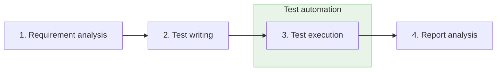
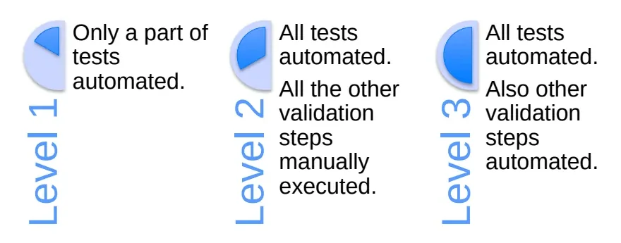
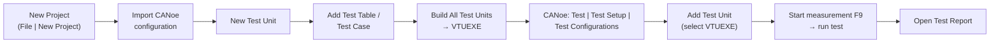
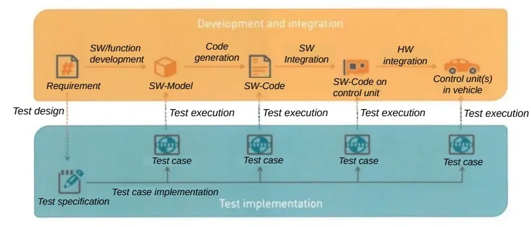
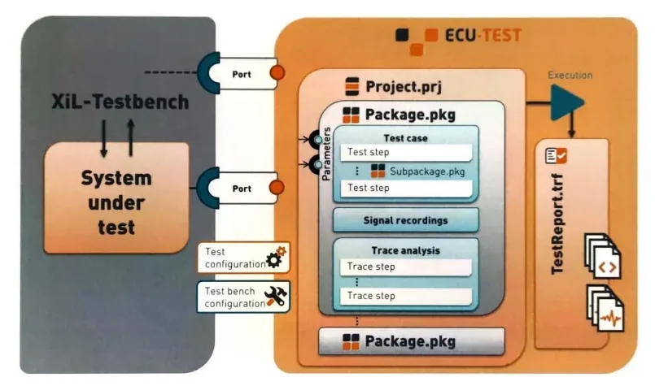
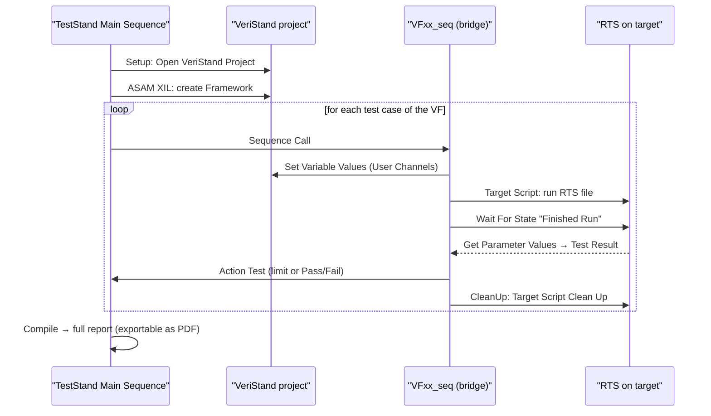

# Test Automation

Welcome to one of the most career-defining lessons of the bootcamp. Up to now
you have run tests by hand: stimulate the ECU (electronic control unit), watch
the reaction, write down the verdict. That works for a handful of tests — but a
single vehicle function can carry dozens of test cases, each one re-executed at
*every* software release, often on a HIL (hardware-in-the-loop) bench that sits
idle all night. **Test automation** hands the repetitive part of that work to
tools and scripts that replay pre-defined actions against the unit under test
(UUT) and produce a report with the verdict — and, on failure, the cause.

By the end of this article you will be able to:

- explain *when* automation pays off and when a human tester is still the
  right tool,
- pick the right toolchain for a job: **CANoe + CAPL**, **Vector vTESTstudio**,
  **TraceTronic ECU-TEST**, or **NI VeriStand + TestStand**,
- follow the concrete click-path from "empty project" to "finished test
  report" on each of them.

## Why automate

Think of the manual validation cycle you already know: four steps, done by a
person, every release. Automation takes over step 3 — and a good chunk of
step 4, because the tool writes the report for you:

The benefits compound over a project's lifetime:

| Property | What it means in practice |
|---|---|
| Efficient | A huge number of tests can run in 24 hours |
| Flexible | Tests run unattended, even at night |
| Fast | Execution is much faster than a human operator |
| Repeatable | The identical test set re-runs at every software release |
| Reliable | No human-generated errors in execution and data logging |
| Versatile | Tests already written are reused in new projects |

Two bonus points your future self will thank you for: automation removes people
from **dangerous tests** and harsh environmental conditions, and the automatic
report largely disposes of a separate bug-logging pass — on failure it shows
the *cause* of the negative verdict, not just the red X.

!!! warning "Automation is not free"
    Be honest with your project manager about the two real limitations: the
    **initial investment** (licenses, bench setup, writing and debugging the
    automated tests) and the fact that it is **not applicable to all tests** —
    subjective evaluations, exploratory testing and one-off checks still need
    a human. The rule of thumb: weigh the investment against how many times
    the test set will actually be re-executed.

### Automation levels

Not every team automates the same share of the workflow — know which level
your project is aiming at:

- **Level 1** — only a part of the tests is automated.
- **Level 2** — all tests are automated; requirement analysis, test writing
  and report review stay manual.
- **Level 3** — all tests automated, *and* the surrounding steps too (report
  generation and distribution, campaign scheduling, …).

## CANoe + CAPL: your first automated tests

The gentlest entry point builds on what you already have: the
[CANoe](../canoe/index.md) environment and the
[CAPL](../capl/index.md) language (Communication Access Programming Language,
Vector's C-like scripting language) from the previous lessons.

Remember that CANoe can simulate an entire network from the communication
database (DBC, Database CAN): the rest-bus nodes exist in simulation and their
**signal values are editable**, but the *signal logic* of the real ECU software
is not reproduced — simulated nodes send only what you tell them to send. For
testing, that is exactly what you need: a controllable world around your ECU.

Two building blocks turn that world into automated tests:

- **Network nodes** — CAPL programs attached to simulation nodes. They can
  emulate ECU behavior, drive panels, control HIL hardware and simulate whole
  networks.
- **CAPL test modules** — CAPL programs structured as test cases: stimulate
  signals, wait for conditions, check responses, log verdicts. CANoe collects
  every module's outcome into a **test report**.

!!! note "When CAPL test modules are the right choice"
    CAPL gives you total freedom — anything you can express in C-like code can
    be a test. The price: programming effort grows with test complexity, the
    report content must be coded inside each test, and the tests are fragile
    against database or interface changes. For a quick, sharp test of one
    feature, CAPL is perfect. For a large, long-lived test set, reach for a
    dedicated authoring tool — read on.

## vTESTstudio: authoring tests without (much) code

**vTESTstudio** is Vector's dedicated development environment for automated ECU
tests. Its killer feature: **three notations for the same test**, freely mixed
within one project — so the tester who thinks in tables, the reviewer who
thinks in diagrams and the engineer who thinks in code can all work on the
same test set.

| Notation | Editor | Best for |
|---|---|---|
| Table-based | Test Table Editor | Classic step-by-step test cases (stimulate → wait → check) |
| Graphical | Test Sequence Diagram, State Diagram | Reviews, coverage-driven test generation |
| Programming-based | Programming Editor | Complex logic, CAPL-like full control |

### From empty project to test report

One mental model to hold onto: vTESTstudio does **not** execute tests. It
*compiles* them and hands them to CANoe, which runs them. The end-to-end flow:

Walk it once and it will stick:

1. **Create the project** — *File | New Project*, choose path and name. To
   share naming and variables with the bus setup, open CANoe, load your
   configuration and **import it into vTESTstudio** before writing any test.
2. **Create a Test Unit** — open the Project View (*Layout | Views | Project
   View*), right-click the project, *New Test Unit*. The test unit is the
   container that will later be compiled and attached to CANoe.
3. **Add a Test Table** — right-click the test unit, *Add | Test Table*.
4. **Create a Test Case** — select the test table, click *Command…*, type
   `test`: the autocomplete assistance opens; select *Test Case* and press
   *Enter*. The test case appears in the Test Tree.
5. **Build** — *Home | Build All Test Units*; the Output window shows errors
   or warnings. A successful build generates an **executable test unit
   (`.VTUEXE`)** in the folder set under *Project | Configuration… | Build*.
6. **Configure in CANoe** — in the CANoe configuration you imported from, go
   to *Test | Test Setup | Test Configurations*, add a test configuration,
   then use *Add Test Unit* and select the VTUEXE file.
7. **Execute** — start the CANoe measurement with **F9**, click *Start* to run
   the test, and when it finishes click *Open Test Report*.

### Anatomy of a test case

Almost every table-notation test case follows the same rhythm — learn it once
and you can read anyone's tests:

| Command | Role |
|---|---|
| Preparation | Establish the initial conditions |
| Set | Write a symbol (signal) from the DBC |
| Wait | Give the ECU time to react |
| Check | Verify a symbol after the set |
| Completion | Exit conditions, restore state |
| Await Value Match | Check that a symbol reaches a value before a timeout |

Two reuse mechanisms keep big test sets sane — use them from day one:

- **Test Case Definitions** — for repetitive tests that differ only in signal
  values. From *Functions* add a *Test Case Definition*, give it a name and
  **parameters**, and write the test once with symbols bound to parameters.
  In the Test Tree you then create a *Test Sequence* that calls the definition
  several times, each with different parameter values.
- **Function Definitions** — for repeated *fragments* of test logic: define
  the commands once, call them from any test case.

**System variables** (for values not on the bus) are created in CANoe under
*Environment*, added according to the DBC, then associated to the test.

### Graphical notations, parameters and variants

The **Test Sequence Diagram** editor defines tests graphically — flows with
decisions, forks and joins — while tabular test code sits behind each
graphical element. It shines in **reviews**, and by default **one test case is
generated for each path through the diagram**. The **State Diagram** editor
goes further: you model the *expected behavior of the system under test* as a
state machine, and test cases are **generated automatically** for transition
coverage, with algorithms such as **Chinese Postman** or breadth-search.

**Parameters** are constant values the test sequence can read in any notation
(Symbol Explorer, *Parameters* tab), and they come in four flavors:

| Kind | Contents | Typical use |
|---|---|---|
| Scalar parameter | one constant value | a fixed threshold |
| Scalar list parameter | 1…n values for one variable | iterate the same test over several temperatures |
| Struct parameter | a set of associated scalar values | one test vector (stimulus + expected values) |
| Struct list parameter | a list of value tuples | iterate over many test vectors |

**Variants** handle ECU and test diversity through *variant properties*: they
drive conditional test coding, expose variant-dependent parameter values and
define variant-dependent test cases or groups.

!!! tip "vTESTstudio vs. raw CAPL"
    Same CANoe underneath — but the test code is drag-and-drop over pre-defined
    commands, the generated report is rich in detail with zero extra coding,
    and parameter/variant handling makes tests robust against change. The
    catch is in the last clause: it only works if you actually use those
    features.

## ECU-TEST: one test, every bench

**ECU-TEST** (by TraceTronic) zooms out one level: instead of scripting the
bus simulation, it automates the control of the **whole test environment**.
Its declared characteristics:

- supports a broad range of test tools (CANoe, HIL benches, measurement and
  calibration hardware, …),
- facilitates each validation step, from design to report analysis,
- is based on user-friendly commands and interfaces,
- **requires no programming skills**,
- allows shared libraries of reusable test building blocks.

### The big idea: environment independence

Here is the concept worth remembering from this whole lesson. ECU-TEST test
cases are designed **once**, from the requirement, and then executed
unchanged at every integration level — model, code, ECU, vehicle:

So when someone asks "what changes if the test environment changes?", the
answer is: the test cases don't — only the configuration that binds them to
the bench does.

### Architecture: project, packages, TCF and TBC

Four pieces, and each has one job:

- **Project (.prj)** — the top-level container, holding **packages (.pkg)**
  with the test cases (sequences of test steps, possibly nested), **signal
  recordings** and **trace analyses**. Execution produces the **test report
  (.trf)**.
- **Ports** — generic interfaces between the test cases and the system under
  test. This is the source of the environment independence: test cases
  reference ports, never concrete hardware.
- **Test Configuration (TCF)** — declares *what* is being tested and with what
  data: the systems under test, the applied simulation models, the A2L and
  database files, report/execution settings.
- **Test Bench Configuration (TBC)** — describes the concrete bench: which
  tools are connected and how each port maps onto them.

Because ports are bound to tools in the TBC rather than in the test cases, the
same package runs on a MIL (model-in-the-loop) model, a HIL rig or the real
vehicle just by swapping configurations. A typical run flows: setup →
stimulation and evaluation steps (with trace analysis of recorded signals) →
execution → report analysis on the generated `.trf`.

## NI VeriStand + TestStand: automating on a HIL rig

The fourth toolchain lives on a **NI (National Instruments) HIL** bench. You
need two ingredients up front: a **UUT** (the control unit under test) and a
**framework** — the coded structure that interacts with the UUT automatically,
here including the VeriStand project the sequences operate on. The output, as
always: a report with the result and, on failure, the cause.

### Real-Time Sequences with the Stimulus Profile Editor

Your authoring tool is the **Stimulus Profile Editor**, an NI VeriStand
component that looks like a standard IDE but manipulates the parameters of the
current VeriStand project. To start it: launch VeriStand, open the project,
then use the **Tool Launcher** and open the *Stimulus Profile Editor* window.

The core construct is the **Real-Time Sequence (RTS)**: the translation into
code of a *single test case* — the maneuvers you would otherwise perform by
hand. Recurring maneuver sequences (e.g. emulating a moving vehicle) are
factored out into **libraries** that test cases recall; library syntax is
identical to test case syntax.

Get to know the editor's panels:

| Panel | Contents |
|---|---|
| Code | the sequence syntax |
| Primitives | Variables; Expressions (assignments); Structures — loops (`while`, `do while`, `for`), conditionals (`if/else`), **Multitasking** for parallel instructions with independent stop; Advanced — suspend the sequence while the real-time primary control loop iterates; Miscellaneous — documentation, state lists |
| Quantities | **Return Variable** (the sequence output: Boolean for OK/KO, or double for a numeric result), **Parameters** (inputs), **Local Variables**, **Channel References** (links to project quantities: aliases, CAN signals, software variables, analog/digital signals) |
| References | all real-time sequences called by the selected one |
| Output | errors and warnings from compilation |

To run a sequence: **compile** it, fix any errors or warnings, open the
project screen (a simplified vehicle–driver interface showing the project
parameters involved), invoke the RTS control from the left menu and press
**Play**. The result is the Return Variable value — `true`/`false` for a
Boolean, or the numeric output for a double.

!!! note "Validate the automation before trusting it"
    This is a habit worth building now: run the manual test and the automated
    sequence on the same condition and check the results match. Only then is
    the test case automated properly — an unvalidated automation is just a
    faster way to be wrong.

### Automating a whole Vehicle Function

A vehicle function's (VF) test set is a collection of RTS files. Two ways run
them as an unattended campaign.

**Option 1 — Stimulus Profile.** The profile first recalls the VeriStand
project through *VeriStand Control*, then invokes each RTS with a **Real-Time
Sequence Call**, where you define:

- the **file path** of the sequence and the **target name** — the target's
  full specification: operating system, IP address, processor tasks, data
  processing loop, execution mode (Low Latency or Parallel), DAQ and DIO
  frequency rates, warmup time, **target rate (Hz)** and **timing source
  timeout (ms)**;
- the **Pass/Fail evaluation**: *Boolean*, *Always Pass*, or
  *NumericBoundsCheck* against a predefined threshold;
- optionally **Update Parameters**, to modify the inputs and study the UUT's
  reaction.

After compilation and launch, the run generates a report listing the result of
each Real-Time Sequence.

**Option 2 — NI TestStand.** TestStand is a separate NI product; here you use
it not to write new sequences in Python, C++ or LabVIEW, but to **invoke the
RTS files you already wrote** in the Stimulus Profile Editor — it replaces the
stimulus profile as the campaign container:

The procedure, step by step:

1. **Main Sequence, Setup section** — open the project: left path *NI
   VeriStand → Open VeriStand Project*; then, under *ASAM XIL* (the standard
   interface between test automation and test benches), select the
   **Framework** item to create the framework based on the open VeriStand
   project.
2. **Bridge sequence `VFxx_seq`** — one per test case:
   - declare the **Test Result** variable;
   - in *Setup*, call **Set Variable Values** to set the parameters defined as
     *User Channels* in the VeriStand project's System Definition File;
   - in *Main*, create the **Target Script** from the left menu and define the
     project path and the RTS file;
   - call **Target Script Wait For State** to align with the RTS's *Finished
     Run* condition, followed by a Wait as synchronization time buffering;
   - call **Target Script Get Parameter Values** to read back the local
     *Test Result*;
   - use **Action Test** to select the verdict mode (numeric *Limit Test* or
     *Pass/Fail*);
   - in *CleanUp*, call **Target Script Clean Up** to clear the target script
     and return to initial conditions.
3. **Main Sequence, Main section** — recall the `VFxx` sequences in cascade
   via **Sequence Call**: as many calls as the VF has test cases. Compiling
   produces the complete report, exportable as a PDF.

## Choosing your tool

When you are dropped into a project, this table is your compass:

| | CAPL test modules | vTESTstudio | ECU-TEST |
|---|---|---|---|
| Pre-settings needed | CANoe project settings | CANoe project settings + build | All linked tools + ECU-TEST settings (TCF/TBC) |
| Test implementation | C-like code writing | Drag & drop of pre-defined functions (table/graphical/code notations) | Drag & drop of pre-defined functions |
| Programming skills | Proportional to test complexity | Limited | None |
| Auto-generated report | Customizable inside each test's code | Rich in detail | Simple and intuitive |
| Robustness against changes | Low | Proportional to proper use of parameters/variants | Proportional to proper use of ports/configurations |

!!! success "Key takeaways"
    - Automation owns step 3 (execution) — and much of step 4 (reporting) — of
      the validation cycle; it pays off when tests re-run many times, but it
      costs up front and never replaces exploratory, human testing.
    - CANoe + CAPL test modules are your quick-and-sharp option inside the
      Vector world: total freedom, at the price of fragility and code.
    - vTESTstudio authors tests in tables, diagrams or code, compiles them to
      a VTUEXE and runs them in CANoe — with Test Case Definitions,
      parameters and variants keeping large test sets maintainable.
    - ECU-TEST's superpower is environment independence: ports plus TCF/TBC
      configurations let the *same* test cases run from software model to
      real vehicle, with no programming at all.
    - On NI HIL rigs, Real-Time Sequences automate single test cases, and
      stimulus profiles or NI TestStand run a whole VF campaign to a
      PDF-ready report.

!!! tip "Where this leads"
    Automated tests are written against functional specifications — see
    [TestCases](../../mil3/testcases/index.md) for how test cases are drafted
    from a VF, and [HIL Users](../../mil3/hil-users/index.md) for the benches
    these automated campaigns run on.

---

## Source material

This article was distilled from the academy lesson materials:

- :material-file-pdf-box: [Test Automation slides ENG](../../assets/mil2/40_TestAutomation/Test_Automation_slides_ENG.pdf) — PDF, 2.0 MB
- :material-file-pdf-box: [Test automation](../../assets/mil2/40_TestAutomation/Test_automation.pdf) — PDF, 4.2 MB
- :material-file-pdf-box: [vTestStudio](../../assets/mil2/40_TestAutomation/vTestStudio.pdf) — PDF, 2.5 MB
