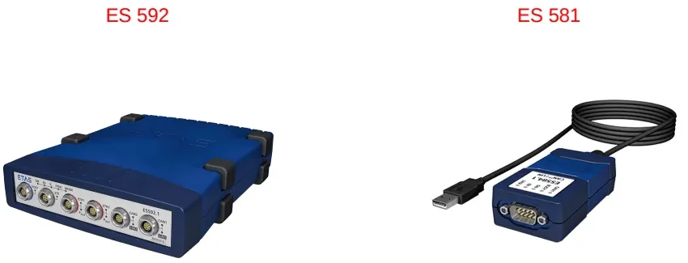
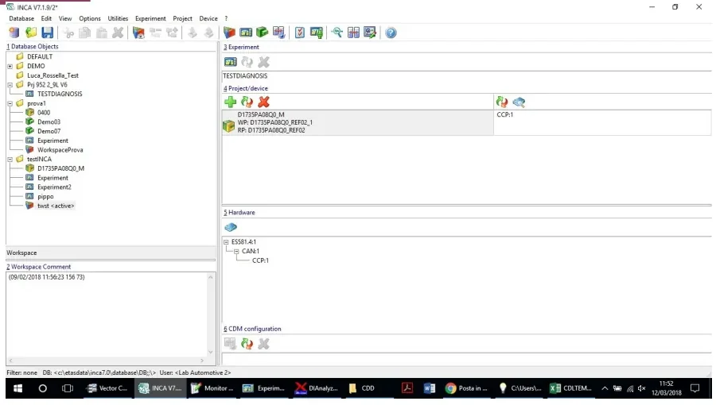
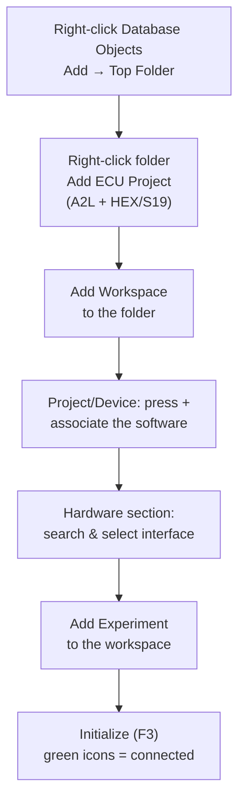

# INCA & MDA — Calibration, Flashing and Measurement Analysis

The engine control module (ECM) — and every other ECU in a modern vehicle —
runs two kinds of software: a **firmware** and an **application** that contains
the control algorithms and strategies (combustion control, power management,
emission control). The application is delivered with a default set of
parameters. **Calibration** is the activity of customizing those parameters for
a specific vehicle application, so that the *same* software can power many
different vehicles and variants.

**INCA** (*INtegrated Calibration and measurement Application*, by ETAS) is the
industry-standard tool for this job. It lets you:

- read the internal variables of the ECU software in real time,
- modify calibration parameters while the ECU is running,
- record measurements for later analysis,
- download (flash) new software onto the ECU memory.

Its companion tool **MDA** (*Measure Data Analyzer*) handles the offline,
post-processing side: opening the measurement files recorded with INCA and
analyzing the signals. This article covers both.

!!! note "Why internal signals matter"
    A CAN log (e.g. from CANalyzer) only shows what the ECU *broadcasts*. INCA
    reads the variables *inside* the software — intermediate calculation
    results, internal states, diagnosis flags — so you can spot a misalignment
    between what the ECU computes and what it puts on the bus.

## Production vs. development ECUs

There are two kinds of ECUs, and the difference is in the memory they carry:

| | Production (closed) ECU | Development (open) ECU |
|---|---|---|
| Memories | ECU flash, ECU RAM, EEPROM | same, **plus** ETK flash and ETK RAM |
| Calibration access | none on the fly | Working Page / Reference Page in ETK RAM |
| Typical cost | ~50–100 € | up to ~15,000 € (depends on microcontroller) |
| Use | customer vehicles | test benches, prototype vehicles |

The three memories of a production unit are:

- **ECU flash** — the processor memory programmed with the complete software,
- **ECU RAM** — volatile support memory,
- **EEPROM** — non-volatile memory where the ECU saves data (learned values,
  DTCs) before switching off.

A development ECU adds two ETK memories:

- **ETK flash** — an additional memory that stores one calibration page while
  the ECU is switched off,
- **ETK RAM** — volatile memory holding **two calibration pages** that can be
  switched on the fly:
  - the **Reference Page (RP)** — read-only, the default calibration dataset
    delivered with the software by the supplier,
  - the **Working Page (WP)** — writable, the dataset you modify during
    development to adapt the software to a specific application.

The connection to the ETK RAM goes through an **ETK cable** plugged into the
development ECU — this physical port is exactly what a closed production ECU
does not have.

## ETAS hardware interfaces

INCA talks to the ECU through ETAS interface hardware. Which box you need
depends on the communication channel:

- **ES 592** — the more complete interface: connects to a development ECU via
  the **ETK cable** *or* via CAN (CCP protocol), and to production ECUs via
  CAN.
- **ES 581** — the simpler interface: CAN only (CCP), for both production and
  development ECUs. It also offers a CAN-monitoring functionality to watch bus
  traffic.
- **ES 89x family** (e.g. ES 891) — modular interfaces used when you must
  combine several ECUs and buses in one setup: one host port to the PC, ETK
  ports for development ECUs, plus CAN FD and LIN channels, so a single log can
  contain internal ECU signals *and* bus traffic together.

!!! tip "Single-ECU shortcut"
    If you only need the internal signals of *one* development ECU, you can
    skip the interface box entirely and use an **ETK host cable** straight from
    the ECU to the PC. And if you only need CAN traffic, an ordinary CAN
    interface through the OBD socket is enough — no ETAS hardware required.

Choose the hardware from the goal of your measurement: logging the internal
signals of one ECU is cheap; merging internal signals, multiple ECUs, CAN FD
and LIN into one synchronized log requires the bigger (and much more
expensive) modular interfaces.

## INCA's main window

The INCA main screen is organized into six macro areas:

1. **Database objects** — the tree of folders, projects, workspaces and
   experiments,
2. **Workspace comment** — free notes attached to the selected workspace,
3. **Experiment** — the measurement/calibration configuration in use,
4. **Project/Device** — the ECU software project associated with the
   workspace,
5. **Hardware** — the interface device and its communication channels,
6. **CDM configuration** — quick access to the Calibration Data Manager.

## Setting up a workspace, step by step

Everything in INCA lives in a database, and connecting to an ECU always
follows the same sequence:

1. **Create a top folder.** Right-click on *Database Objects* → *Add → Top
   Folder*. This is the container that keeps everything for a project
   together.
2. **Add the ECU project (the software).** Right-click the folder → *Add ECU
   Project* and follow the wizard. INCA can only talk to an ECU whose software
   it knows, so you must import two files:
   - the **A2L file** — the base of the software: an ASAM-standard description
     of every variable and parameter, with physical characteristics and the
     memory address where each element lives;
   - the **calibration dataset** — HEX, S19, csv, srec, … depending on the
     supplier. S19 and HEX serve the same purpose; some projects deliver
     several dataset files (e.g. separate files with immobilizer variants —
     pick the one matching your vehicle configuration).
3. **Create a workspace** in the same folder (*Add Workspace*). The workspace
   holds everything needed to connect: software + hardware + experiment.
4. **Associate software and hardware.** In the *Project/Device* section press
   **+** and add the software; in the *Hardware* section click the hardware
   icon and choose the device matching your communication channel (ETK, CCP,
   …). Use the **magnifier icon** to search for the connected interface — when
   the hardware is found and correctly associated its icon turns **green**
   (red means not connected/not aligned).
5. **Add an experiment** to the workspace (or import a ready-made one —
   experiments are exchanged as `.EXP` files, so a colleague or calibrator can
   hand you the exact set of variables they need).

!!! tip "Protect your base dataset"
    After importing, INCA shows the dataset next to the project name. A good
    habit is to duplicate it and keep the original **frozen** (right-click →
    set read-only / freeze). That way you always have a pristine reference
    dataset, and you make your modifications on the copy.

## Working Page vs. Reference Page

On a development ECU, INCA can switch in real time between the two calibration
pages in ETK RAM:

- **Reference Page (RP)** — read-only; the supplier's default calibration.
- **Working Page (WP)** — writable; your modified dataset.

You cannot edit calibrations while the ECU runs on the reference page — switch
to the working page first. The INCA status bar shows the ECU state: *ECU off /
no access* when there is no communication, a checksum warning when WP and RP
diverge, and zero differences when everything is aligned.

**Alignment** means that three copies of the calibration are consistent: the
working page, the reference page, and what is actually flashed on the ECU.
Press **F3** (Fn+F3 on laptops) or the *initialize hardware* button to start
initialization and alignment. Useful settings:

- enable **"initialize automatically"** so INCA aligns on its own at every
  connection,
- if you have unsaved work in the working page, enable the **download to
  working page** option and set the auto-start behavior to *always working
  page*, so your modifications survive re-initialization — and always confirm
  with **Apply**.

## The experiment: measuring and calibrating

The **experiment** is the working environment where you watch and modify the
ECU live. It contains the measurement and calibration variables you selected
for your task.

### Selecting variables and rasters

Open the **Variable selection** window to pick what to follow:

- **Measurement variables** — readable values: raw sensor data, actuator
  command values, internal states. For each of them you choose an
  **acquisition raster** (sampling period).
- **Calibration variables** — writable parameters: torque maps, diagnosis
  enables, thresholds.

Variables are grouped by software module (suppliers build the software from
many modules), and the search box accepts wildcards (`*`) when you only
remember part of a signal name.

!!! warning "Choose the raster faster than the signal"
    The raster is the sampling time of your signals. If a variable evolves
    every 25 ms but you watch it at 100 ms, you lose three samples out of four
    — a peak to 400 and back to zero can pass completely unseen. Typical
    rasters range from 25 ms (the fastest on some ECUs) up to 125 ms or more;
    other projects offer 10 ms or even 1 ms. Match the raster to the real
    dynamics of what you are testing. If you forgot to set it, you can change
    the measure rate afterwards from the experiment window.

### Running the measurement

Three commands control acquisition:

- **Start visualization** — watch the variables live, without saving,
- **Start recording** — watch *and* save to a measurement file,
- **Stop measuring** — stop both.

The maximum recording time depends on your PC's free disk space and the number
of selected variables (from about an hour on a loaded setup to many hours).
Calibration changes on the working page use handy shortcuts: **F7** increment,
**F6** decrement, **Ctrl+U** reset all changes back to the reference page
values.

### Which signals to pick

Build the experiment around your test case. For vehicle testing, always keep
the basic status feedback in front of you — ignition/key state, contactor
closed, drive-ready, park lock engaged, the feedback from the other ECUs — so
you understand the vehicle's state *through INCA* without looking at the
vehicle. Then add the signals specific to the function under test, both the
CAN-visible ones and their internal counterparts.

### Recording configuration

Before saving a recording, INCA asks for a file name and comment. Adopt a
strict naming convention — the log will be read by calibrators and function
owners who are not on your project:

1. **date** at the beginning,
2. **project** and **facility** (vehicle / HIL / simulator — a vehicle log
   carries more weight because simulator wiring may be imperfect),
3. **software and calibration version** used,
4. **test name/number and result** (OK / not OK).

An auto-increment option (test 1, test 2, …) keeps naming consistent during
checklists.

**Triggers** are for event-based acquisition: instead of logging hours of
data, you define a condition (e.g. a software reset, a DTC being set, hard
acceleration) and INCA records a window around it — e.g. 30 minutes before
and 30 minutes after the event. For manual logging on bench or vehicle,
leave triggers off.

## Memory page operations and flashing

The *Manage Memory Pages* section offers four operations:

| Operation | What it does |
|---|---|
| **Download** | copies the INCA database dataset onto the ECU's **Working Page** in RAM |
| **Copy** | copies Working Page → Reference Page or vice versa (useful to restore a WP) |
| **Upload** | retrieves WP and RP from the ECU memory into the INCA database |
| **Flash programming** | writes software and/or calibration into the ECU's **permanent** flash memory |

### Flash programming procedure

1. In the memory pages window, select **Flash programming** (code and data)
   and press **Do it**.
2. INCA opens the **ProF** settings — the ProF is the flash configuration file
   of the ECU, a "translation" that tells INCA how to program this specific
   unit. Click **Configure**, point INCA at the ProF file for your software
   version (it ships with the release notes) and install it. One ProF file can
   contain several profiles for different vehicle projects.
3. Press **OK**: INCA erases the EEPROM and downloads the new software, then
   notifies you when the procedure is finished and starts the automatic
   alignment.

!!! warning "Flash code and calibration together"
    Unless you know the software hasn't changed, flash the complete package
    (code + data + calibration) — code and dataset are meant to be associated.
    Flashing only the calibration dataset is acceptable when the base software
    is unchanged, but on active projects with weekly releases the full flash
    is the safe default.

!!! tip "The bootloader is your recovery path"
    The bootloader is a separate HEX file listed in the release notes. Flash it
    only when it changes — not at every release. But if you ever lose
    communication with the ECU (e.g. after flashing the wrong software),
    reflashing the bootloader is the way to recover the unit.

## CDM — Calibration Data Manager

**CDM** processes calibration datasets inside INCA: it manages several
datasets simultaneously with **Copy, List, Compare and Merge** functions, and
exports calibration data to **Excel, HTML or ASCII**.

### Comparing two datasets

1. Choose the **comparison source** (click the `...` icon) — it can be an
   external file (e.g. `.HEX`) or a dataset in the INCA database.
2. Right-click in the **Comparing Destination** window → *Add dataset* (or add
   from file), then click the added dataset to activate it.
3. Select the variables to compare — a subset or the entire dataset.
4. Use the **=** and **≠** buttons to show only equal or only different
   variables between the two datasets.
5. In the *Action* window pick the operation — **Compare**, **Copy** or
   **List** — and the output **format** (HTML, ASCII, …). The generated HTML
   report lists each calibration with its value in the master dataset and in
   the compared one, making differences immediately visible.

CDM is also where you edit datasets offline: change a value (e.g. a diagnosis
enable from 0 to 1), close the window and save — the dataset in the database
is updated. If you don't want further accidental changes, **freeze** the
dataset again (read-only). To move single calibrations between datasets, use
**Copy** from the drop-down menu and select either all variables or only the
highlighted ones; the same menu exports to Excel/HTML/ASCII.

!!! tip "Calibrations from a colleague"
    When a calibrator sends you a file of parameters to try (DCM or CSV), you
    don't have to type them in: in the experiment, use *read all calibrations
    from file* and pick the file. INCA applies the values to the working page
    and immediately shows the difference against the reference page.

## MDA — Measure Data Analyzer

**MDA** is the post-processing tool: it opens the `.dat` measurement files
recorded by INCA and lets you analyze the acquired variables offline. The
typical workflow:

1. Open MDA and load the `.dat` file (*File* → choose the measurement, or
   *New configuration* → *Add* the file).
2. In the **Variable Explorer**, pick the variables to display and choose the
   display mode. The most comfortable view is the **oscilloscope**
   (`<new_oscilloscope>`): drag and drop the variables onto it.
3. To read curves clearly, highlight the variables, right-click → **Move to
   individual strip**, then **Zoom to fit** (or use *Distribute Uniformly*) so
   each signal gets its own strip at a readable scale.
4. Use the cursors to read signal values and the **difference between two
   points** (time or value deltas).

Keep the software/dataset information attached to the recording — when you
reopen the log weeks later, knowing which software and calibration generated
it is what makes the data meaningful.

!!! tip "Practice offline first"
    INCA works offline without any ECU: import an A2L + dataset, build an
    experiment, and practice variable selection, rasters, CDM compares and MDA
    analysis on your PC before going to the vehicle. When you do connect for
    real, the only new steps are hardware detection and alignment. Also check
    your INCA version — newer ECU software releases may require a newer INCA
    (e.g. 7.3 instead of 7.2) to open the project.

!!! success "Key takeaways"
    - Calibration = adapting one software to many applications by editing its
      parameter dataset; INCA is the tool that reads ECU internals, edits
      calibrations live, records measurements and flashes software.
    - Development ECUs add ETK flash/RAM with two switchable pages:
      read-only **Reference Page** (supplier defaults) vs. writable **Working
      Page** (your changes). Switch to WP before editing; align with F3.
    - A workspace ties together software (A2L description + HEX/S19 dataset),
      ETAS hardware (ES 592 for ETK+CAN, ES 581 for CAN/CCP only) and an
      experiment (`.EXP`).
    - Pick measurement variables with a raster faster than the signal's
      dynamics; record with a disciplined naming convention (date, project,
      facility, software, test, result); use triggers for event-based logging.
    - Flash programming writes permanent memory and needs the ProF
      configuration file; flash code + calibration together, and keep the
      bootloader in mind as a recovery path.
    - CDM compares/copies/merges datasets and exports HTML/Excel/ASCII
      reports; MDA opens the `.dat` logs offline with oscilloscope strips and
      cursors for the real analysis.

!!! tip "Where this leads"
    This lesson builds on [INCA](../inca/index.md) basics. The recordings you
    produce here feed the [Verification](../../mil4/verification/index.md) and
    [Troubleshooting](../../mil4/troubleshooting/index.md) activities, and bus
    traffic logged in parallel is analyzed in [CANalyzer](../../mil2/canalyzer/index.md).

---

## Source material

This article was distilled from the academy lesson materials:

- :material-file-pdf-box: [Academy Kineton Format - INCA MDA](../../assets/mil3/27_INCA_2/Academy_Kineton_Format___INCA_MDA.pdf) — PDF, 3.2 MB
- :material-file-pdf-box: [ETAS manual](../../assets/mil3/27_INCA_2/ETAS_manual.pdf) — PDF, 3.9 MB

## Downloads

- :material-file: [INCA & MDA pt2](../../assets/mil3/27_INCA_2/INCA_&_MDA_pt2_.json) — 11.8 KB
- :material-file: [INCA & MDA pt2](../../assets/mil3/27_INCA_2/INCA_&_MDA_pt2_.srt) — 2.8 KB
- :material-file: [INCA & MDA pt2](../../assets/mil3/27_INCA_2/INCA_&_MDA_pt2_.tsv) — 2.3 KB
- :material-file: [INCA & MDA pt2](../../assets/mil3/27_INCA_2/INCA_&_MDA_pt2_.vtt) — 2.6 KB
- :material-file: [INCA (2024 05 14 11 04 GMT+2)](../../assets/mil3/27_INCA_2/INCA_(2024_05_14_11_04_GMT+2).json) — 199.7 KB
- :material-file: [INCA (2024 05 14 11 04 GMT+2)](../../assets/mil3/27_INCA_2/INCA_(2024_05_14_11_04_GMT+2).srt) — 44.7 KB
- :material-file: [INCA (2024 05 14 11 04 GMT+2)](../../assets/mil3/27_INCA_2/INCA_(2024_05_14_11_04_GMT+2).tsv) — 35.6 KB
- :material-file: [INCA (2024 05 14 11 04 GMT+2)](../../assets/mil3/27_INCA_2/INCA_(2024_05_14_11_04_GMT+2).vtt) — 40.2 KB
- :material-file: [INCA & MDA pt2 (lecture transcript)](../../assets/mil3/27_INCA_2/INCA_&_MDA_pt2_.txt) — 1.9 KB
- :material-file: [INCA (2024 05 14 11 04 GMT+2) (lecture transcript)](../../assets/mil3/27_INCA_2/INCA_(2024_05_14_11_04_GMT+2).txt) — 28.6 KB
