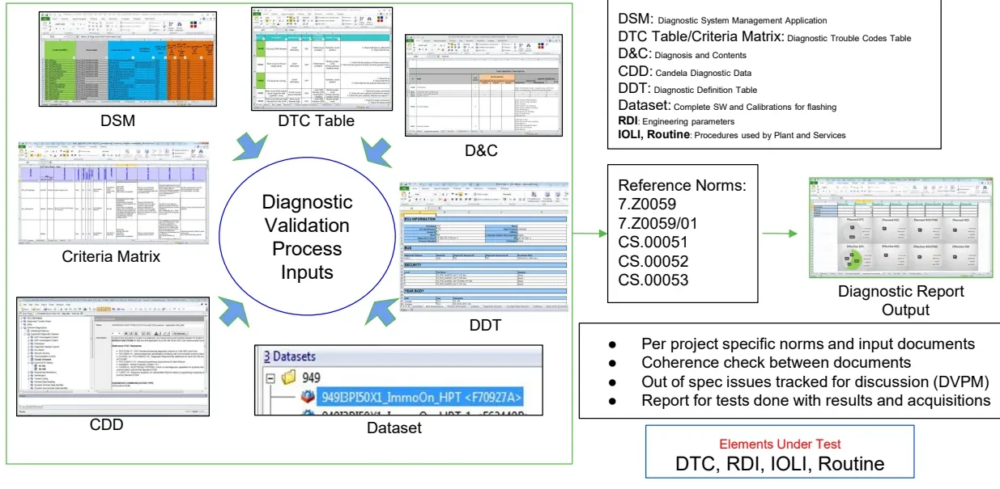
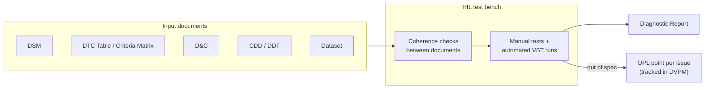
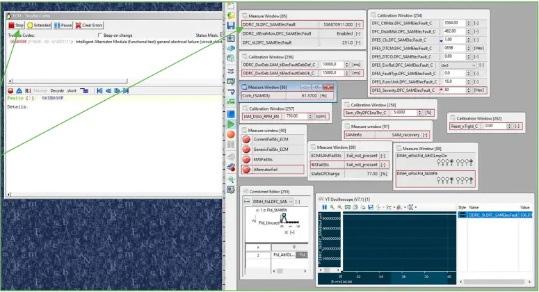
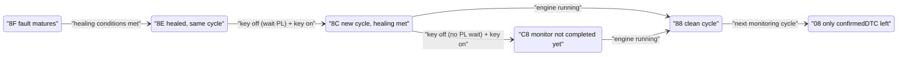
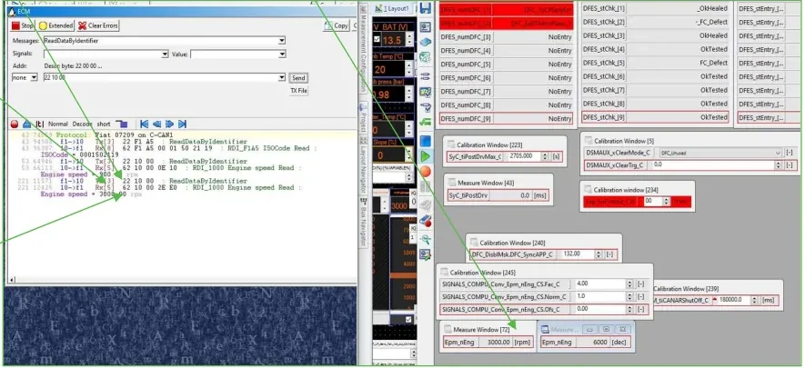

# Diagnosis Process Validation

Before the software of an electronic control unit (ECU) can be released, its
**diagnostic content** must be checked against the specification — every
trouble code, every readable parameter, every tester-activated procedure.
This article describes that validation process.

By the end of this article you will be able to:

- explain which specification documents feed diagnostic validation and check
  them against each other for contradictions;
- set up a fault on a Hardware-in-the-Loop (HIL) bench and walk a trouble code
  through its complete life cycle, watching the status byte evolve step by step;
- validate the four diagnostic object types — **DTCs, IOLIs, Routines and
  RDIs** — with a repeatable procedure;
- document your findings so they can be reproduced, discussed and closed.

The techniques here build directly on the Unified Diagnostic Services (UDS)
concepts from [Diagnosis](../../mil2/diagnosis/index.md) (services, sessions,
status bytes) and on the measurement/calibration workflow from
[INCA](../../mil3/inca/index.md). Review them first if needed; the remainder
of this article is practical.

## The validation process at a glance

Diagnostic validation is fundamentally a **document-driven coherence check**.
The same diagnostic feature is described in several specification documents
written by different teams at different times. Validation proceeds in two
phases: verifying that all documents agree with each other, and verifying that
the ECU software behaves as written. Most defects found are simple mismatches,
and the bench process exists to catch them before release.



The input documents you will work with every day:

| Document | Full name | What it specifies |
|---|---|---|
| **DSM** | Diagnostic System Management application | The project-level diagnostic database |
| **DTC Table / Criteria Matrix** | Diagnostic Trouble Codes Table | Every DTC with its maturation criteria, MIL class and healing conditions |
| **D&C** | Diagnosis and Contents | What the ECU must offer: sessions, services, RDIs, IOLIs, routines |
| **CDD** | Candela Diagnostic Data | The machine-readable diagnostic description used to configure the testers |
| **DDT** | Diagnostic Definition Table | Detailed definition of diagnostic data and conversion formulas |
| **Dataset** | — | The complete software + calibration package flashed on the ECU under test |

The elements under test are the four diagnostic object types: **DTC**
(Diagnostic Trouble Code — a stored fault), **RDI** (engineering parameters,
read and written by data identifier), **IOLI** (Input/Output Line Interface
procedures) and **Routine** (tester-activated procedures used by the plant and
by service, e.g. actuator tests and resets of learned values).

The applicable **reference norms** for the project are 7.Z0059, 7.Z0059/01,
CS.00051, CS.00052 and CS.00053 — they define the general diagnostic behavior
(status byte evolution, error memory management, timing) that every DTC must
follow.

The single output of the process is the **Diagnostic Report**: which tests were
run, their results, and the names of the acquisitions that prove them. Anything
found out of spec is tracked for discussion in the **DVPM** meeting and opened
as a point in the **OPL** (Open Points List) management system.



## The test environment

Validation tests run on a **HIL bench** equipped with the real ECUs — typically
the ECM (engine control module), HCP (hybrid control processor) and TCM
(transmission control module) — plus their real actuators. Faults and maneuvers
are reproduced in the different vehicle conditions the specification requires:

- **Power On** — key on, engine off,
- **Cranking**,
- **Engine Running / Propulsion active**,
- **Vehicle Running**.

Four tools are used in combination, each for its own role:

| Tool | Role in diagnostic validation |
|---|---|
| **ControlDesk** | Drives the HIL bench and simulates vehicle conditions |
| **INCA** | Measures and calibrates internal ECU signals; used to force fault conditions and to read internal values for comparison |
| **DIAnalyzer** | The diagnostic tester: sends UDS requests, reads the error memory, checks status bytes and snapshots |
| **CDA** | Diagnostic data environment (per project specification) |

New diagnostic tests are always executed **manually first**; the maneuvers that
work are collected and shared so they can be **automated in the VST test
platform**, which then re-runs the already-automated diagnosis cases. The two
modes complement each other: manual exploration, then regression automation.

## Checks common to every element

Whatever the element type, three families of checks always apply:

1. **Coherence between documents.** The element must exist with the same
   definition in the D&C, in the CDD/DDT and (for DTCs) in the Criteria
   Matrix. Every diagnostic session listed in the D&C must also be active in
   the CDD, with matching descriptions.
2. **Enabling and healing conditions.** Each condition is removed one at a
   time and the effect on the element's behavior is observed — a condition
   that has no effect when removed is a specification or software error.
3. **Sessions and addressing.** Requests are sent in *all* diagnostic sessions
   and with both **physical addressing** (one specific ECU answers,
   `Addr = none` in the tester) and **functional addressing** (the request is
   broadcast, `Addr = ALL`, and every ECU that supports the service answers).
   In functional addressing, if no ECU answers at all, the tester reports an
   **Rx Timeout** — that's expected, not a tool failure.

!!! note "Positive and negative responses are equally important"
    A diagnostic feature is not validated when it works — it is validated when
    it works *and* fails the way the CDD says it should. Every negative
    response code listed in the CDD must be provoked and checked. Limiting
    tests to the positive cases is a common source of incomplete coverage.

## DTC validation

### Collecting the DTC's details

For each Diagnostic Trouble Code, the Criteria Matrix (checked against the DSM
and the DDT for coherence) provides the full test plan:

- the **MIL class** — whether this fault must light the malfunction indicator
  lamp (MIL, the dashboard "check engine" light) or not;
- the **maturation time** — how long the fault condition must persist before
  the DTC is stored — and the **de-maturation time**;
- the **enabling conditions** (when the monitor is allowed to run) and the
  **healing conditions** (how the DTC returns to a clean state).

Two project rules are checked before any bench work, since they catch setup
problems that would otherwise make a test fail for reasons unrelated to the
diagnostic implementation:

- every RDI referenced by the Criteria Matrix must actually be **active in the
  dataset** flashed on the ECU;
- the **MIL status** of the DTC must be identical across all documents.

### A worked example: P065B

As a concrete example, consider DTC **P065B** — "Intelligent Alternator Module
(functional test) general electrical failure (circuit short to battery or
open)", internally the DFC (Diagnostic Fault Code) `DFC_SAMElecFault`. The
maturation criterion is that the signal `IAM_ECM_FEEDBACK.ElectricalFault`
equals 1, and the DTC Table requires the warning indicator to stay **OFF** for
this fault.

You simulate the fault while the engine is running (forcing the internal
signal in INCA), and after the maturation time elapses the DTC is stored in
the error memory with **status byte `8F`**.



In this particular test the MIL actually turned **ON** — contradicting the DTC
Table. The mismatch is reported as a finding: an OPL point is opened asking for
clarification, and no calibration is changed, in line with the approval rule
below.

!!! warning "Approval rule"
    For final approval, the maneuvers must simulate **all input conditions**
    (every combination that enables the monitor), but they must **not** change
    the diagnosis boundary conditions — you validate the diagnostic as
    calibrated, you do not recalibrate it to make it pass.

### Following the status byte across key cycles

Most of a DTC test is a walk through key on/off cycles, checking that the
**DTC status byte** (ISO 14229) evolves as the norms require. This sequence is
the core of the DTC test procedure. The relevant bits:

| Bit | Meaning |
|---|---|
| 0 (`01`) | testFailed — fault present right now |
| 1 (`02`) | testFailedThisOperationCycle |
| 2 (`04`) | pendingDTC |
| 3 (`08`) | confirmedDTC — stored in error memory |
| 6 (`40`) | testNotCompletedThisOperationCycle |
| 7 (`80`) | warningIndicatorRequested |

The validation sequence for one DTC looks like this:

| Step | Action | Expected status byte | Why |
|---|---|---|---|
| 1 | Set the fault (engine running), wait maturation time | `8F` | Fault tested, failed, pending and confirmed; warning bit set |
| 2 | Key off, wait the **power latch time** until the ECM really shuts down; key on | `CD` if the monitor cannot run in key on, `8F` if it can and the fault is still present | Depends on the DTC's enabling conditions |
| 3 | Heal the fault per the DTC Table (fault was already confirmed) | `8E` | Fault no longer present, but still failed this cycle |
| 4 | Key off, wait power latch, key on | `8C` | Healing conditions met, fault not present in this new cycle |
| 5 | Key off **without** waiting for power latch, key on | `C8` | Monitor not yet completed in this cycle |
| 6 | Engine running | `88` | Only confirmed + warning bits remain |
| 7 | Next monitoring cycle | `88` again, then `08` | The pending/test-failed bits are cleared cycle by cycle until only the confirmed bit survives |



Two practical rules from the bench:

- **Alternate** waiting and not waiting for the power latch time between key
  cycles — this covers more software initialization paths and exposes DTCs
  that behave differently depending on whether the ECU fully shut down.
- DTC storage must always follow the status byte evolution required by the
  project norms; any jump or missing step is an OPL point.

### Checking snapshots with service $19

When a DTC is stored, the ECU also freezes a **snapshot** (freeze frame) of
environmental parameters, recording the vehicle state at the moment of failure. You verify it with UDS service `0x19` subfunction `0x04`
(reportDTCSnapshotRecordByDTCNumber). For P065B, whose 3-byte DTC number is
`06 5B 00`:

```
19 04 06 5B 00 00   → snapshot record 0 must be POPULATED  (first storage)
19 04 06 5B 00 01   → snapshot record 1 must be VOID       (never stored twice yet)
```

Rules checked:

- on the **first** storage there must be exactly **one** snapshot — a second
  record while the fault was never healed and never re-detected is an error;
- after healing the fault, re-setting it and cycling the key, a **second**
  snapshot must appear — and its content must be checked for coherence too;
- the environmental parameters in the snapshot must match the same parameters
  read live in INCA, and must **not contain unknown RDIs**.

Also verify that the **expected recoveries work** (the healing path in the DTC
Table) and that **unwanted recoveries are not active** (the DTC must not clear
itself through a path the specification does not allow).

## IOLI and Routine validation

IOLIs and Routines are **tester-activated procedures** — actuator commands,
resets of learned values, self-tests. They share one procedure, with a few
routine-specific steps.

For both element types:

1. **Coherence**: the D&C and the CDD/DDT must list the same sessions, the same
   descriptions and the same positive/negative responses.
2. **Enabling conditions**: check all of them, then remove them one by one and
   verify the request is now refused with the expected **negative response**.
3. **All sessions, both addressing types**: start the IOLI/routine in every
   diagnostic session, in physical and in functional addressing, in Power On
   and Engine Running conditions; report any unexpected positive or negative
   answer. As a general rule **Engine Running is excluded by all IOLIs** —
   check the CDD for the specific vehicle conditions each one requires.
4. **Effect on the actuator**: a positive response must produce exactly the
   behavior the CDD promises — the actuator is really commanded, or (for reset
   IOLIs) the **internal measuring points are zeroed and the adaptive learning
   parameters are reset**.
5. **Execution/activation time** must respect the CDD and the norms.

Routine-specific checks:

- exercise the full command sequence — **Start / Stop / Result request** — and
  verify each step's response;
- check that the routine correctly **inhibits the DTCs** that would otherwise
  be set by its own artificial conditions (a routine that stores trouble codes
  while running is a defect).

## RDI validation

RDIs (the engineering parameters read via `ReadDataByIdentifier`) are validated
for content, access and **conversion**.

1. **Measuring points**: the RDIs listed in the D&C and CDD must exist and be
   readable; prepare an acquisition with all measuring points of the element
   under test.
2. **Environmental conditions**: run the maneuvers needed to exercise the RDI
   across its range.
3. **Access rules**: read and write the RDI in all diagnostic sessions and in
   both addressing types; every enabling condition for reading/writing is
   checked and then removed to provoke the documented negative responses.
4. **Conversion formulas** are checked by setting and unsetting values and
   comparing the tester against the ECU's internal representation.

### The two conversion formulas

There are two distinct conversions, and they must not be confused with each
other.

**The ECU-internal formula** (from the software manual) converts between the
internal integer and the physical value as the software sees it:

```
phys = fac_sw × int + offset_sw
900 rpm = 0.50 × 1800 + 0
```

**The D&C conversion formula** is what the *diagnostic tester* uses to turn the
hexadecimal response into the physical value it displays. It is **not** the
internal representation of the RDI:

```
Phys = (FAC × DEC) / DEN + OFS
HEX value = 2E E0  →  DEC value = 12000
FAC = 1, DEN = 4, OFS = 0
3000 rpm = (1 × 12000) / 4 + 0
```



Coverage rules:

- for **linear RDIs**, check at least **3 measuring values** spread across the
  range (the formula must hold at every point, not just at the ends);
- for **encoded/bit-mapped RDIs**, check **every bit** individually — perform
  the maneuvers that set and unset each bit;
- for **non-linear RDIs**, perform all maneuvers needed to fully exercise every
  region of the characteristic.

## Reporting and issue management

All test activity must be documented. For each experiment:

1. **Save the acquisitions** from every tool, using one consistent base name —
   the convention used in the project is
   `<DFC>_<DTC>_<Dataset>_<Date>`, for example:
   - INCA: `DFC_APPPlausBrk_P2299_520AMBI50x1_20200910.dat`
   - DIAnalyzer: `DFC_APPPlausBrk_P2299_520AMBI50x1_20200910.log`
2. **Create a DCM file** with all the calibrations used during the experiment,
   so the result is reproducible.
3. **Write the results** and the acquisition names into the diagnostic report
   file.
4. **Open an OPL point** for every issue found and notify the OPL mailing list.
   The e-mail object convention is
   `SoftwareLineProject_DVPM_<version>_<family>_<dataset>_#<point number>: short description`,
   e.g. `P1619_DVPM_2.1_FamB_E6dFinal_520AMBI52X1_#1272: Speed Limiter - 2 key
   cycle ISSUE`.

!!! warning "One issue, one OPL point"
    Never mix several issues into a single OPL item — each finding must be
    tracked, discussed at the DVPM and closed individually.

!!! success "Key takeaways"
    - Diagnostic validation is a coherence exercise: DSM, DTC Table/Criteria
      Matrix, D&C, CDD/DDT and the dataset must all agree — and then the ECU
      must behave as written.
    - Tests run on the HIL bench (real ECM/HCP/TCM + actuators) with
      ControlDesk, INCA, DIAnalyzer and CDA, across all vehicle conditions;
      proven maneuvers are automated in VST.
    - DTC testing covers maturation, MIL class, enabling/healing conditions,
      and a disciplined key-cycle walk through the status byte (`8F → 8E → 8C →
      C8 → 88 → 08`), with snapshot checks via `19 04 <DTC> <record>`.
    - IOLIs and Routines are checked in every session and both addressing
      types, for positive *and* negative responses, actuator effect, parameter
      zeroing and execution time.
    - RDIs require both conversion formulas: the ECU-internal one
      (`phys = fac_sw × int + offset_sw`) and the D&C tester one
      (`Phys = (FAC × DEC)/DEN + OFS`) — 3 points for linear RDIs, every bit
      for encoded ones.
    - Every experiment produces named acquisitions + a DCM; every issue gets
      its own OPL point.

!!! tip "Where this leads"
    The fault-finding approach and the error-memory mechanics covered here are
    applied to real vehicle problems in
    [Troubleshooting](../troubleshooting/index.md) and
    [First Level Analysis](../first-level-analysis/index.md).

---

## Source material

This article was distilled from the academy lesson materials:

- :material-file-pdf-box: [Diagnosis Process](../../assets/mil4/32_Diagnosis_Process/32_Diagnosis_Process.pdf) — PDF, 4.4 MB
