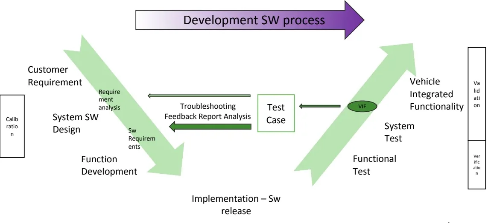
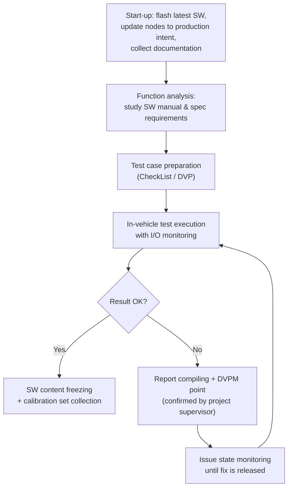
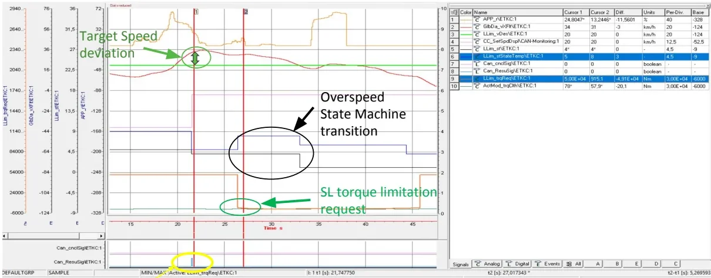
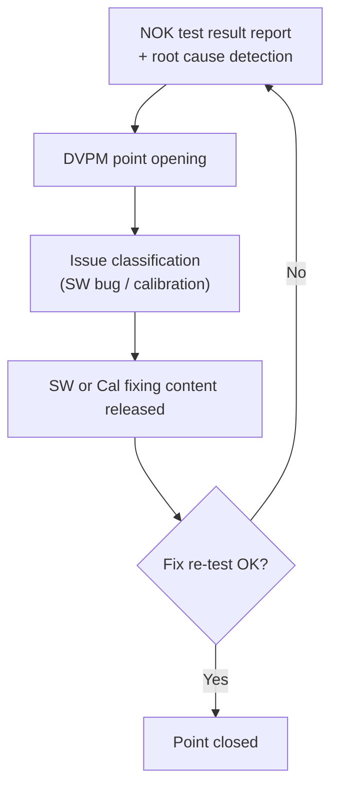
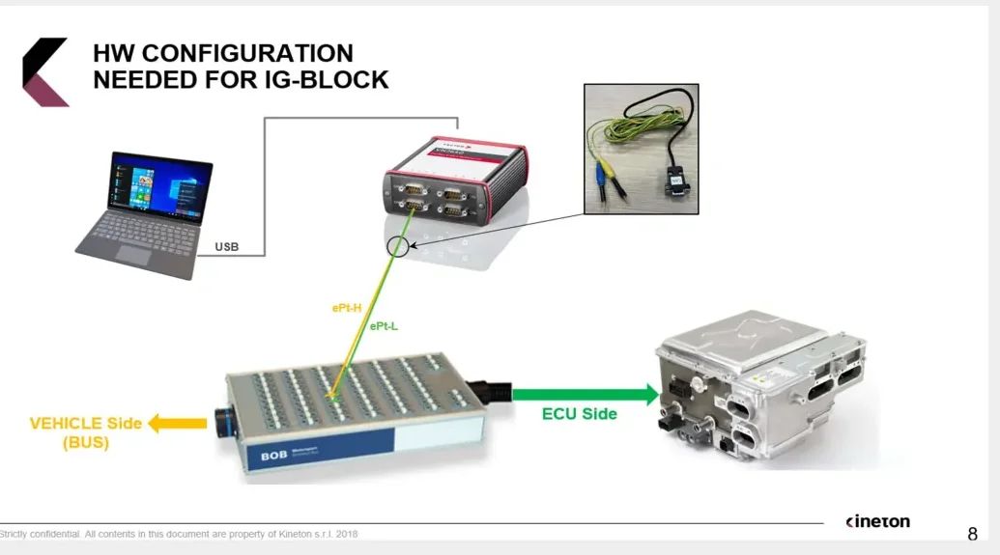

# Vehicle Validation

Vehicle validation is the final test stage of the development cycle. Earlier
stages (simulation, bench rigs, lab measurements) exercise the function in
controlled environments; vehicle validation tests it in the real car, with
real physics and all ECUs interacting.

This article covers:

- what **validation** checks that verification doesn't, and why the vehicle
  environment cannot be skipped,
- the validation workflow from requirement to frozen software, and the
  document set (VF, CFTS, CheckList, DVPM) that drives it,
- a worked example — the ECM speed limiter — from spec, to maneuver, to
  measurement, to a detected software bug,
- safe working practice on a BEV prototype: wiring a CAN case, flashing ECUs,
  and injecting faults.

## Verification vs. validation

The distinction in one sentence: **verification** checks the code
was written correctly against its design; **validation** checks that the
*implemented* control logic, running on the real system, actually behaves the
way the original concept and requirements promised.

By the time a function reaches the vehicle, it has already passed
simulated environments — MiL (Model-in-the-Loop), SiL (Software-in-the-Loop),
HiL (Hardware-in-the-Loop). The vehicle nevertheless adds three things no rig
fully reproduces:

- **Real dynamics and disturbances.** Friction, inertia, thermal behavior,
  tolerances — the controlled system answers a stimulus with all its physical
  complexity, and no model captures that perfectly.
- **Real ECU interactions.** On the bench, the nodes you don't care about are
  simulated or simply absent. In the car, every ECU is live, talking, and
  occasionally interfering.
- **Proof of the simulation itself.** A passing vehicle test is evidence that
  your earlier simulated results were trustworthy. A *failing* one shows
  exactly where the model diverged from reality.

The trade-off is **controllability**. In a HiL rig you can force any input
to any value at any moment. In a vehicle the sensors are physical, so to reach
a given system state you must perform an actual **maneuver** — if a function
only activates with a warm engine, you drive until the coolant reaches
temperature. Designing maneuvers that reliably bring the system into the
required state is a core validation skill.

## Where validation sits in the V-model



This activity is formally called **Vehicle Integrated Functionality (VIF)
validation**, and it's the last step on the right-hand branch of the software
development V-cycle, closing the loop after functional test and system test.
The daily workflow:

1. Requirements and functional specifications (from the left-hand branch) are
   translated into executable **test cases** — collected in a CheckList, part of
   the DVP (Design Validation Plan).
2. You execute the maneuvers in the vehicle, monitoring and measuring the
   system behavior as you go.
3. Results go into a **report** fed back to the development teams — function
   developers, calibrators, suppliers — with bug-fix suggestions and software
   modifications. That's the troubleshooting feedback path in the diagram.
4. When everything is positive, the software content is **frozen** together
   with its calibration set. Done — until the next release.



## Speaking the paperwork: your validation document set

Validation at Stellantis runs on a standard set of documents. These acronyms
appear throughout the workflow:

| Document | What it is |
|---|---|
| **VF** (Vehicle Function) | Requirement description for a single application/function |
| **CFTS** (Component Functional Technical Specification) | Functional characteristics (e.g. a speed limiter's minimum set point) and the functional structure of the controls, valid per architecture |
| **PTMS** | Specifications of the vehicle interface functions for the engine control system; a high-level description of the main ECM functionalities and their interactions |
| **CheckList** | Your output test document: a list of maneuvers, each with the expected (or explicitly negated) system behavior, derived from the requirements |
| **General Report** | Collects all test results and procedure notes |
| **DVPM** (Design Validation Plan & Results) | Tracks NOK points and anomalies to be fixed; an embedded macro computes the progress state of the whole activity |

The **CheckList layout** mirrors the requirements one-to-one: each row names
the functionality, the specific feature under test, the **condition** (the
maneuver to perform) and the **verification** (the expected system behavior,
quoting the requirement). A checklist is usually unique per *architecture* —
all projects on the same architecture support the same features, which are then
enabled, disabled or calibrated per application.

### From requirement to test case

The translation from spec to maneuver must preserve the requirement's intent
while being executable in the real world. A concrete example: the requirement
says the thermostatic coolant valve must stay closed during the first phase of
engine warm-up, and the ECM must command it open once the coolant temperature
approaches the target idling temperature. The corresponding test case reads:

> Turn on the engine and wait until the coolant temperature is regulated
> between 80 °C and 90 °C (depending on the engine's thermal characteristics).
> Check that the sensed valve position stays fully closed for 10 seconds after
> engine start, and that it is partially/fully opened once the temperature has
> been regulated.

The pattern to follow: a condition that can be physically realized, a
measurable expected behavior, and concrete values.

!!! tip "Map the names before you drive"
    The variables named in the requirement rarely match the labels you read in
    the measurement tool (INCA). Part of your function analysis is mapping
    requirement entities to the real software labels *before* you go testing —
    discovering the mismatch mid-maneuver costs significant test time.

## Worked example: validating the ECM speed limiter

This section follows one complete validation end to end.

### The function

The speed limiter caps vehicle speed at a driver-selected threshold. On the
PowerNet architecture (Jeep Wrangler) it spans three ECUs: the **SCCM**
(Steering Column Control Module, reads the driver's steering-wheel commands),
the **IPC** (Instrument Panel Cluster, displays the setpoint), and the **ECM**
(Engine Control Module), which does the real work — that's why it's called the
*whole ECM speed limiter*: the ECM computes the speed setpoint from the
steering-wheel buttons and, in coordination with the ESP (Electronic Stability
Program), actuates the torque limitation that tracks it.

### Inside the software

The control is a *wrappered* function with two main blocks:

- **SLCM** (the Stellantis implementation) — elaborates the target speed the
  driver requests through the steering commands (e.g. SL On → Set+ → Res).
- **Llim** (the Bosch implementation) — actuates the speed control, built from
  three subfunctions:
    - **Llim_Stm** — the status machine: recognizes the operational driving
      condition from the monitored inputs and outputs the control state.
    - **Llim_CalcLim** — computes the output control torque from the state.
    - **Llim_ShOff** — handles shut-off/inhibition of the control under the
      conditions defined by the status machine.

```mermaid
flowchart LR
    DRV["Driver buttons<br/>(CAN commands)"] --> SLCM["SLCM<br/>target speed"]
    SLCM --> subgraph LLIM["Llim (Bosch)"]
        STM["Llim_Stm<br/>status machine"] --> CALC["Llim_CalcLim<br/>torque computation"]
        SHOFF["Llim_ShOff<br/>inhibition"] --> STM
    end
    CALC --> TRQ["SL torque reduction request"]
```

### The overspeed test

The **overspeed state** is entered when the vehicle runs faster than the
setpoint with the limiter engaged, for longer than a defined time. The
requirement regulates how the system must react; the checklist condenses that
into a maneuver that forces the overspeed (the condition) plus the compliant
reaction to check (the verification).

While you execute it, you monitor the function's inputs and outputs live:

- the relevant sensed values — vehicle speed and the internal **timer/speed
  thresholds** that gate the state transition (threshold values are INCA
  calibration data),
- the system reaction — the **state machine evolution** and the resulting
  torque limitation request.



The measurement shows the full sequence: the driver's SL activation command,
the vehicle speed drifting above the target, the state machine transitioning
into the overspeed state once the timer expires, and the SL torque limitation
request pulling the speed back down. If all of that matches the spec, the test
is OK and goes into the report. If not, the result is NOK and enters the
troubleshooting loop described below.

### A real NOK: the Start & Stop trap

Some of the most valuable tests target the **interaction between functions** —
a frequent source of defects. In this case the scenario was the speed
limiter's behavior after a Start & Stop re-crank. The measurement showed the
requirement being violated: after the autostop maneuver, the limiter was
wrongly turned off — the limitation setpoint collapsed to 0 km/h.

Root cause: the SL internal model was mishandling a **state machine
transition** during the re-crank. Because the fault lives inside the state
machine logic, with no calibration involved, this is a **software bug**
(hardcoded behavior) — not something a calibrator can fix by changing data.
That distinction matters, and the next section is built on it.

## When a test fails: the troubleshooting loop

Every NOK result enters a formal loop:



The rules that keep the loop honest:

- A DVPM point is opened only when the negative behavior is **confirmed by the
  project supervisor** — you flag it, they validate it.
- The DVPM document keeps the full trace of NOK tests and anomalies and gives
  the global progress state of the activity.
- Always classify the issue: a **calibration problem** is fixed with new data;
  a **software bug** requires a code change, a new release, and a full re-test
  of the function. Getting this right saves everyone weeks.

## Why the vehicle still wins: the cam-backup story

The **crankshaft tone wheel backup strategy** is a concrete case of a behavior
that can only be assessed conclusively in the vehicle.

Engine position is essential — injection control, variable valve actuation,
gear management and fuel pressure all descend from it. The requirement (engine
speed calculation) says, in essence:

- RPM is computed from crank sensor tooth periods; once the crank position is
  locked and two top-dead-center (TDC) positions have been traversed, it's
  computed from the two TDCs.
- If the crank sensor fails but the cam sensor is still valid, engine speed
  must be computed — and reported on CAN in `ECM_A1.EngRPM` — from the
  **camshaft** signal instead (up to 8160 RPM, ramped to 0 when the active
  sensor unlocks).

The backup logic: if teeth are systematically missing, the ECM waits **7
crankshaft revolutions** (counted via the camshaft signal, since crank and cam
positions are strictly related) before declaring the crank source faulty — the
debounce time is calibratable — then applies the cam-backup strategy and sets a
diagnostic fault. If the speed computed from the camshaft is above a fixed
threshold (e.g. 500 RPM), the ECM pilots injection to hold idle; below it, the
engine is shut down.

Testing this means performing a **crankshaft loss-of-signal** at idle. The same
test, two environments:

| Environment | Successful idle recoveries |
|---|---|
| HiL | 8 out of 10 |
| Vehicle | about 5 out of 10 |

Same software, same maneuver — a markedly different outcome. The gap comes
from real engine physics (friction losses, mechanical inertia) that the model
did not reproduce reliably. The conclusion: **test significance depends on the
environment**, and vehicle testing remains the decisive check.

!!! note "Appendix: calibration, ETK and CCP/XCP"
    Three terms used routinely in validation work:
    - **Calibration** is what lets one software application run on different
      engine/vehicle variants (a 1.6 L 120 hp manual and a 2.0 L 180 hp
      automatic on the same ECU hardware): the control logic is common, the
      data tunes it to the application.
    - **ETK** (Emulator-Tastkopf, emulator test probe) is the ETAS development
      interface fitted in development ECUs. It connects in parallel to the
      processor bus lines and can replace program and/or calibration data,
      allowing online parameter changes; its dual-port RAM streams measured
      internal values to tools like INCA.
    - **CCP/XCP** (CAN Calibration Protocol / eXtended Calibration Protocol)
      provide runtime read/write access to ECU variables and memory through
      standard interfaces instead of an ETK: CCP over CAN; XCP also over
      FlexRay, Ethernet or USB (and supports flashing).

## Hands-on: a day on the M182 BEV prototype

This section covers the practical procedures from a validation campaign on the
**Maserati M182** battery-electric prototype: vehicle orientation, wiring
measurement hardware, monitoring buses, flashing ECUs, and injecting faults
safely.

The high-voltage hardware and control modules are: the **EDM** (Electric Drive
Machine = motor + inverter, 400 V / up to 1 kA), the **OBCM** (On-Board Charger
Module), the **EVSE** (Electric Vehicle Supply Equipment — the charging
station), the **ECH/BCH** (coolant heaters), plus the control modules: **SGW**
(Secure Gateway), **VDCM** (Vehicle Domain Control Module), **BPCM** (Battery
Pack Control Module), **MCPA/MCPB** (front/rear Motor Control Processors),
**IPC** and **CADM**.

### Getting oriented in the car

- The **12 V battery** sits under the front hood. Its negative-pole cable has a
  button that releases it without tools — useful, because disconnecting the
  12 V is a routine step.
- **OBD sockets** — driver side, lower left: the **FD-CAN6** socket (the
  diagnostic CAN, the same one service uses) and next to it the **FD-CAN11**
  socket. Passenger side: three more sockets carrying **FD-CAN 5, 14 and 3**.
  Every cable carries a label with its connection info — always work from those
  labels, never from memory.
- It is possible to close the "door closed" switch by hand to keep the door
  open without the acoustic warning.

!!! warning "After a 12 V reconnect"
    Two steps must not be skipped:
    - After detaching/reattaching the 12 V battery you must press the
      door-open button on the key, otherwise the vehicle will not go into
      charge.
    - The vehicle must be **re-proxied** (proxi alignment, see below) or
      several functions misbehave.

### Wiring the CAN case

The cable labels follow the scheme `FDx: location pins connector (channel on
CAN case)` — for example `FD3: Psngr LH 2-10 ept (channel 2 on CAN case)` means:
passenger side, cable marked "LH", use the breakout lead identified as 2-10,
land it on CAN case channel 2. Each breakout must go to its own CAN or nothing
is read. The standard channel mapping:

| CAN case channel | Bus |
|---|---|
| 1 | LIN (reserved) |
| 2 | FD-CAN 3 |
| 3 | FD-CAN 6 |
| 4 | FD-CAN 11 |

FD-CAN 5 and 14 are used in specific cases only; to sniff them, use any free
channel except channel 1. The pin numbers in the labels (e.g. `Driver 6-14`)
refer to the OBD output pins, which are in continuity with pins 2 and 7 of the
DB-9 connector that plugs into the CAN case. One termination rule to remember:
the **120 Ω resistor is needed on the vehicle side only**, not on the VDCM side.

### Monitoring with CANalyzer

1. Load a pre-built configuration (File → last used). For the M182 activity,
   **configuration 3** monitors the CANs; configurations 1 and 2 are the
   **gateway** setups (FD-CAN3 and FD-CAN 11+5) that contain the CAPL code used
   to modify signals on those buses.
2. Load the DBCs into the channels (database management) *before* starting.
3. Start the measurement — with logging (click the square icon next to the
   "Trace Complete" folder, then Start) or *Start without logging* for live
   viewing only. To sniff in the vehicle you must be **Online**.
4. At start, the **channel mapping** window appears: the upper section lists
   the application channels (with their DBCs), the Hardware section lists the
   physical CAN case channels. Align them, click *deactivate unmapped*, then OK
   — the trace now shows decoded traffic.
5. To acquire **all** the buses you need **two CAN cases**: connect the first,
   wait until it appears in the application channel mapping, *then* connect the
   second.

Recommended monitoring practices:

- If a CAN does not go to sleep, the first message to check is the **NM**
  (Network Management) message — it tells you which ECU is requesting to stay
  awake.
- Always keep the **contactor status signal** on screen: before disconnecting
  the high-voltage battery, do key-off, watch the contactors open in CANalyzer,
  *then* disconnect.
- Watch the **12 V battery voltage** signal: it must never drop below
  **11.5 V**, or the battery is dying and must be charged. During a flash the
  12 V is not being recharged — if it dies mid-flash it's as if the battery had
  been disconnected, so verify its charge first.
- Right-click → *Create Common Axis* groups several signals into one named
  graphic section.

### Flashing and diagnostics with CDA

- Software flashing goes through the **FD-CAN6** (diagnostic CAN) with the
  **CDA** tool. CANalyzer must be in **Stop** while CDA is active.
- In CDA: *vehicle mode* → *vehicle*, select the channel (e.g. channel 3 for
  CAN 6) and tick the FD-CAN entry, pick model year and vehicle, then **unlock
  the ECU**. From CDA you can read DTCs (Diagnostic Trouble Codes) from all
  ECUs (*Vehicle Wide DTCs*), not just the VDCM.
- **Proxi alignment** (needed after a 12 V reconnect) — two methods:
    1. *Vehicle alignment* in CDA: tick the required items, press the green
       arrow, do a key cycle, then *refresh*.
    2. Manual: read the proxi code from the **BCM** (Body Control Module) with
       the PID editor (read command `22 20 24`), copy the returned string
       (starting from byte `30`; the `62` prefix = `22 + 40` is just the
       positive response), and write it to the **VDCM** (write command
       `2E 20 23`).
- Quick sanity check that the vehicle is proxied: switch drive mode from
  Normal to Sport and see if the car lowers (in Offroad it must raise).

### Safety first: the two mushrooms and the HVIL

Prototype cars carry hardware safety interlocks; their function must be
understood before vehicle testing:

- **Red mushroom** (normally up) — commands **zero torque**. Push it only when
  there is an unintended acceleration.
- **Yellow mushroom** (normally down) — part of the **HVIL** (High Voltage
  Interlock Loop). Raising it opens the loop.

The HVIL is a wire that loops in and out of every high-voltage connector. If
any contact is lost, the **VDCM and BPCM open the contactors** and discharge
the HV bus: the VDCM first ramps the current down, then the BPCM commands the
opening — this order protects the contactors from burning under high current.

### Fault injection with the BOB



The **BOB** (Breakout Box) replicates the VDCM pinout and sits between the
vehicle harness and the ECU — each pin has two posts: one toward the vehicle,
one toward the VDCM. (On this project only side **K/B** matters.) To tell which
post is which, disconnect the BOB from the vehicle-side cable and check
continuity between the BOB pin and the corresponding pin on the cable.

With the BOB you can create the classic faults, using the wiring harness pin
list (e.g. `FD11 (B72, B88)` = CAN-high on B72, CAN-low on B88; the second
parenthesized pair is just a duplicate and can be ignored):

- **Open circuit** — simply remove one of the two pins.
- **Short to ground** — bridge the pin (e.g. B72) to a vehicle ground pin
  (B2, B4 or B6).
- **Short to battery** — first make an open, then apply battery voltage
  (**pin B1**) to the **ECU-side** post only.

!!! warning "Short-to-battery discipline"
    Always inject the short to battery on the **ECU side**. Doing it on the
    vehicle side would apply battery voltage to sensors and actuators designed
    for a lower supply and can damage them. Use a cable with an **inline fuse**
    for these shorts.

### Inserting a gateway

"Doing a gateway" means **modifying signals on the fly** between the vehicle
and the VDCM using CAPL in CANalyzer — used to test how the ECU reacts to
modified messages. You need the CAN case and **two
breakout leads** (one vehicle side, one VDCM side) with three output pins for
CAN/LIN:

1. Vehicle-side lead: pin **7 → CAN-high**, pin **2 → CAN-low** (for LIN: pins
   **7 and 3**), e.g. onto B72/B88 vehicle side. This branch goes to the CAN
   case **with a 120 Ω termination in parallel** — the CAN case has no internal
   termination, and the vehicle branch is no longer closed by the ECU.
2. VDCM-side lead: pin 7 → ECU-side high, pin 2 → ECU-side low, DB-9 to the CAN
   case **without** the resistor (the ECU's internal termination closes this
   branch).
3. In CANalyzer, one channel carries all messages *received from* the VDCM and
   the other the messages *transmitted to* it — the ones you modify with CAPL.

!!! warning "Network entry sequence"
    Because you are physically breaking into the network, you must **disconnect
    the 12 V battery first**, then start the gateway (Start in CANalyzer), then
    reconnect the battery. Only this sequence lets the gateway join the network
    cleanly.

### Power-management note

Since the car is a prototype, disconnect the 12 V battery when tests are done.
If you leave it connected, the vehicle goes to sleep to protect the battery,
and the **APM** (Auxiliary Power Module) monitors the 12 V state during sleep:
if it detects discharge, it wakes up and recharges the 12 V battery from the
400 V HV battery — so with a healthy vehicle, the 12 V battery should never die
on its own. Disconnect it regardless.

!!! success "Key takeaways"
    - Validation proves the implemented software against the original
      requirements — and **VIF validation in the vehicle** is the last V-cycle
      step, the only place with real dynamics and real ECU interactions.
    - Requirements become maneuvers (CheckList/DVP): every test is a
      **condition** you realize plus a **verification** you check; NOK results
      open a **DVPM point** and enter the troubleshooting loop.
    - The speed limiter example covered the full chain: requirement →
      checklist → I/O monitoring → measurement → bug found in a state
      transition (a software bug, not a calibration issue — the distinction
      determines the fix path).
    - Environment matters: the cam-backup strategy passed 8/10 on HiL but only
      ~5/10 in the vehicle; vehicle testing is the decisive check.
    - The BEV prototype section covered: locating the OBD sockets and CAN case
      channels, never flashing with a weak 12 V battery, re-proxying after a
      battery reconnect, the HVIL/mushroom safety logic, and fault injection
      with the BOB (shorts to battery on the ECU side only, fused cable).

---

## Source material

This article was distilled from the academy lesson materials:

- :material-file-pdf-box: [Validazione BEV](../../assets/mil4/31_Validation/31_Validazione_BEV.pdf) — PDF, 3.7 MB
- :material-file-pdf-box: [Validazione VF](../../assets/mil4/31_Validation/31_Validazione_VF.pdf) — PDF, 2.5 MB
