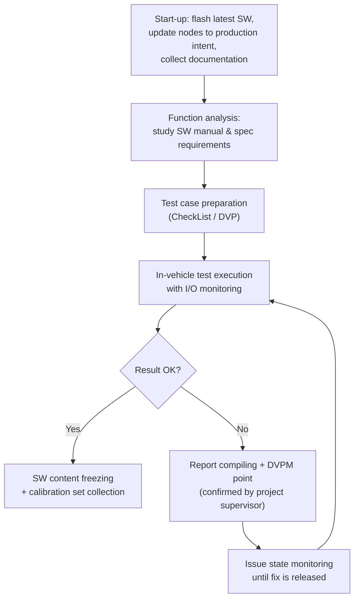
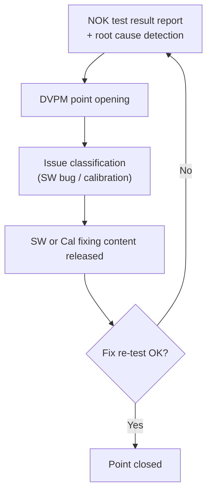

# Vehicle Validation

Validation answers a simple question: **does the software we built behave the way
the original concept said it should?** Verification checks that the code was
written correctly against its design; validation checks that the *implemented*
control logic, running on the real system, actually produces the response the
requirements promised.

This article covers **Vehicle Integrated Functionality (VIF) validation** — the
final, highest-fidelity test stage, performed on a real vehicle — and then walks
through the practical side of working on a prototype car: connecting to its
networks, flashing and diagnosing ECUs, and injecting faults safely.

## Why validate in a vehicle?

By the time a function reaches vehicle validation, it has already been exercised
in simulated environments (MiL, SiL, HiL). The vehicle adds something none of
those can fully reproduce:

- **Real dynamics and disturbances.** The controlled system answers a stimulus
  with all its physical complexity — friction, inertia, thermal behavior,
  tolerances — none of which a model captures perfectly.
- **Real interactions between ECUs.** On the bench, non-involved nodes are
  simulated or absent; in the car, every ECU is live and interacting.
- **Proof of the simulation itself.** A successful vehicle test confirms that
  the results obtained in the simulated environment were trustworthy.

The price you pay is **controllability**. In a HiL rig you can force any input
to any value at any moment. In a vehicle, sensors are real physical entities, so
to reach a specific system state you must perform an actual **maneuver** — for
example, if a function only activates with a warm engine, you have to drive the
car until the coolant reaches temperature. Designing maneuvers that reliably
push the system into the required state is a core skill of the validator.

## Where validation sits in the V-model


Vehicle validation is the **last step of the software development V-cycle**: it
closes the right-hand branch after functional test and system test. The workflow
is driven by documentation coming from the left-hand branch:

1. Requirements and functional specifications are translated into **test cases**
   (CheckList / DVP — Design Validation Plan).
2. The validator executes the maneuvers in the vehicle, measures and analyzes
   the system behavior.
3. Results go into a **report** that is fed back to the development teams
   (function developers, calibrators, suppliers), closing the loop with bug-fix
   suggestions and software modifications — this is the troubleshooting feedback
   path in the diagram.
4. When the result is positive, the software content is **frozen** together with
   its calibration set.



## The validation documentation set

Stellantis validation activities revolve around a standard document set:

| Document | Role |
|---|---|
| **VF** (Vehicle Function) | Requirement description for a single application/function |
| **CFTS** (Component Functional Technical Specification) | Functional characteristics (e.g. speed limiter minimum set point) and the functional structure of the controls, valid per architecture |
| **PTMS** | Specifications of the vehicle interface functions for the engine control system; high-level description of the main ECM functionalities and their interaction |
| **CheckList** | The output test document: a list of maneuvers, each with the expected (or explicitly negated) system behavior, derived from the requirements |
| **General Report** | Collects all test results and procedure notes |
| **DVPM** (Design Validation Plan & Results) | Tracks NOK points and anomalies to be fixed; a macro computes the progress state of the whole activity |

The **CheckList layout** maps directly onto requirements: each row identifies
the functionality, the specific feature under test, the **condition** (the
maneuver to perform) and the **verification** (the expected system behavior,
quoting the requirement). A checklist is usually unique per *architecture* — all
projects on the same architecture support the same features, which are then
enabled, disabled or calibrated per application.

### From requirement to test case

The translation from spec to maneuver must preserve the requirement's intent
while being executable in the real environment. Example: the requirement says
the thermostatic coolant valve must stay closed during the first phase of engine
warm-up, and the ECM must command opening once the coolant temperature
approaches the target idling temperature. The corresponding test case:

> Turn on the engine and wait until the coolant temperature is regulated between
> 80 °C and 90 °C (depending on the engine's thermal characteristics). Check
> that the sensed valve position stays fully closed for 10 seconds after engine
> start, and that it is partially/fully opened once the temperature has been
> regulated.

!!! tip
    The variables named in the requirement do not necessarily match the labels
    you read in the measurement tool (INCA). Part of the function analysis is
    mapping requirement entities to the real SW labels before you go testing.

## Worked example: ECM Speed Limiter validation

### The function

The speed limiter caps vehicle speed at a driver-selected threshold. On the
PowerNet architecture (Jeep Wrangler) it involves three ECUs: **SCCM** (steering
column control, reads the driver commands), **IPC** (instrument cluster,
displays the setpoint) and **ECM**, which does the real work — this is why it is
called **whole ECM speed limiter**: the ECM computes the speed setpoint from the
steering-wheel buttons and, in coordination with ESP, actuates the torque
limitation that tracks it.

### The software structure

The control is a *wrappered* function with two main blocks:

- **SLCM** (Stellantis implementation) — elaborates the target speed requested
  by the driver through the steering commands (e.g. SL On → Set+ → Res).
- **Llim** (Bosch implementation) — actuates the speed control, built from three
  subfunctions:
    - **Llim_Stm** — the status machine: recognizes the operational driving
      condition from monitored inputs and outputs the control state.
    - **Llim_CalcLim** — computes the output control torque from the state.
    - **Llim_ShOff** — handles shut-off/inhibition of the control under the
      conditions defined by the status machine.

```mermaid
flowchart LR
    DRV["Driver buttons<br/>(CAN commands)"] --> SLCM["SLCM<br/>target speed"]
    SLCM --> subgraph LLIM["Llim (Bosch)"]
        STM["Llim_Stm<br/>status machine"] --> CALC["Llim_CalcLim<br/>torque computation"]
        SHOFF["Llim_ShOff<br/>inhibition"] --> STM
    end
    CALC --> TRQ["SL torque reduction request"]
```

### The overspeed test

The **overspeed state** is entered when the vehicle runs faster than the
setpoint with the limiter engaged, for longer than a defined time. The
requirement regulates how the system must react; the checklist condenses it into
a maneuver that forces the overspeed (condition) plus the compliant reaction to
check (verification).

During execution you monitor, as I/O of the function under test:

- the relevant sensed values — vehicle speed and the internal **timer/speed
  thresholds** that gate the state transition (threshold values are INCA
  calibration data),
- the system reaction — the **state machine evolution** and the resulting torque
  limitation request.


In the measurement above you can read the whole story: the driver's SL
activation command, the vehicle speed deviating above the target, the state
machine transition into the overspeed state once the timer expires, and the SL
torque limitation request that brings the speed back. If all of this matches the
spec, the test is OK and goes into the report; otherwise it is a NOK.

### A real NOK: interaction with Start & Stop

Some of the most valuable tests target the **interaction between functions**.
In this case the scenario was the speed limiter's behavior after a Start & Stop
re-crank. The measurement showed the requirement being violated: after the
autostop maneuver, the SL was wrongly turned off — the limitation setpoint
collapsed to 0 km/h.

Root cause: the SL internal model was mishandling a **state machine transition**
during the re-crank. Because the fault lives inside the state machine logic with
no calibration involved, this is a **software bug** (hardcoded behavior), not
something a calibrator can fix by changing data.

## Troubleshooting and issue tracking

Every NOK result enters a formal loop:



Key rules of the loop:

- A DVPM point is opened only when the negative behavior is **confirmed by the
  project supervisor**.
- The DVPM document (with an embedded macro) keeps the trace of NOK tests and
  anomalies, giving the global progress state of the activity.
- Distinguishing *SW issue* from *calibration issue* matters: a calibration
  problem is fixed with new data; a SW bug requires a code change and a new
  release, then a full re-test of the function.

## Why the vehicle still wins: the cam-backup story

The **crankshaft tone wheel backup strategy** is a good example of a test whose
significance changes with the environment. Engine position is essential —
injection control, variable valve actuation, gear management and fuel pressure
all descend from it. The requirement (engine speed calculation) says, in
essence:

- RPM is computed from crank sensor tooth periods; once the crank position is
  locked and two top-dead-center positions have been traversed, it is computed
  from the two TDCs.
- If the crank sensor fails but the cam sensor is still valid, engine speed must
  be computed — and reported on CAN in `ECM_A1.EngRPM` — from the **camshaft**
  signal instead (up to 8160 RPM, ramped to 0 when the active sensor unlocks).

The backup logic: if teeth are systematically missing, the ECM waits
**7 crankshaft revolutions** (counted via the camshaft signal, since crank and
cam positions are strictly related) before declaring the crank source faulty —
the debounce time is calibratable — then applies the cam-backup strategy and
sets a diagnostic fault. If the speed computed from the camshaft is above a
fixed threshold (e.g. 500 RPM), the ECM pilots injection to hold idle; below it,
the engine is shut down.

Testing this means performing a **crankshaft loss-of-signal** in idle
conditions. The result differed sharply by environment:

| Environment | Successful idle recoveries |
|---|---|
| HiL | 8 out of 10 |
| Vehicle | about 5 out of 10 |

The gap comes from real engine physics — friction losses, mechanical inertia —
that the model did not reproduce reliably. The lesson: **test significance
depends on the environment**, and some behaviors can only be judged in the
vehicle.

!!! note "Appendix: calibration, ETK and CCP/XCP"
    - **Calibration** is what lets one software application run on different
      engine/vehicle variants (e.g. a 1.6 L 120 hp manual and a 2.0 L 180 hp
      automatic on the same ECU hardware): the control logic is common, the
      data tunes it to the application.
    - **ETK** (Emulator-Tastkopf, emulator test probe) is the ETAS development
      interface fitted in development ECUs. It connects in parallel to the
      processor bus lines and can replace program and/or calibration data,
      allowing online parameter changes; its dual-port RAM streams measured
      internal values to tools like INCA.
    - **CCP/XCP** (CAN Calibration Protocol / eXtended Calibration Protocol)
      provide runtime read/write access to ECU variables and memory through
      standard interfaces instead of an ETK: CCP over CAN; XCP also over
      FlexRay, Ethernet or USB (and supports flashing).

## Hands-on: in-vehicle validation on a BEV prototype (Maserati M182)

This section is the practical playbook used on the M182 BEV prototype. The main
actors on the high-voltage side: the **EDM** (Electric Drive Machine = motor +
inverter, 400 V / up to 1 kA), **OBCM** (on-board charger), **EVSE** (supply
equipment), **ECH/BCH** (coolant heaters), plus the control modules **SGW**
(secure gateway), **VDCM** (vehicle domain control module), **BPCM** (battery
pack control module), **MCPA/MCPB** (front/rear motor control processors),
**IPC** and **CADM**.

### Getting oriented in the car

- The **12 V battery** sits in the front hood. Its negative-pole cable has a
  button that releases it without tools — handy because disconnecting the 12 V
  is a routine step.
- **OBD sockets** — driver side, lower left: the **FD-CAN6** socket (the
  diagnostic CAN, the one service also uses) and next to it the **FD-CAN11**
  socket. Passenger side: three more sockets carrying **FD-CAN 5, 14 and 3**.
  Every cable carries a label with its connection info — always work from those
  labels.
- Trick: you can close the "door closed" switch by hand to keep the door open
  without the acoustic warning.

!!! warning "After a 12 V reconnect"
    Two things bite you if you forget them:
    - After detaching/reattaching the 12 V battery you must press the door-open
      button on the key, otherwise the vehicle will not go into charge.
    - The vehicle must be **re-proxied** (proxi alignment, see below) or several
      functions misbehave.

### Wiring the CAN case

The cable labels follow the scheme `FDx: location pins connector (channel on CAN
case)` — for example `FD3: Psngr LH 2-10 ept (channel 2 on CAN case)` means:
passenger side, cable marked "LH", use the breakout lead ("briglia") identified
as 2-10, land it on CAN case channel 2. Each breakout must go to its own CAN or
nothing is read. The standard channel mapping:

| CAN case channel | Bus |
|---|---|
| 1 | LIN (reserved) |
| 2 | FD-CAN 3 |
| 3 | FD-CAN 6 |
| 4 | FD-CAN 11 |

FD-CAN 5 and 14 are used in specific cases only; to sniff them use any free
channel except channel 1. The pin numbers in the labels (e.g. `Driver 6-14`)
refer to the OBD output pins, which are in continuity with pins 2 and 7 of the
DB-9 connector that plugs into the CAN case. Termination: the **120 Ω resistor
is needed on the vehicle side only**, not on the VDCM side.

### Monitoring with CANalyzer

1. Load a pre-built configuration (File → last used). For the M182 activity:
   **configuration 3** monitors the CANs; configurations 1 and 2 are the
   **gateway** setups (FD-CAN3 and FD-CAN 11+5) that contain the CAPL code used
   to modify signals on those buses.
2. Load the DBCs into the channels (database management) *before* starting.
3. Start the measurement — with logging (click the square icon next to the
   "Trace Complete" folder, then Start) or *Start without logging* for live
   viewing only. To sniff in the vehicle you must be **Online**.
4. At start, the **channel mapping** window appears: the upper section lists the
   application channels (with their DBCs), the Hardware section lists the
   physical CAN case channels. Align them, click *deactivate unmapped*, then OK
   — the trace now shows decoded traffic.
5. To acquire **all** the buses you need **two CAN cases**: connect the first,
   wait until it appears in the application channel mapping, *then* connect the
   second.

Practical habits from the field:

- If a CAN does not go to sleep, the first message to check is the **NM
  (network management)** message — it tells you which ECU is requesting to stay
  awake.
- Always keep the **contactor status signal** on screen: before disconnecting
  the HV battery, do key-off, watch the contactors open in CANalyzer, *then*
  disconnect.
- Watch the **12 V battery voltage** signal: it must never drop below
  **11.5 V**, or the battery is dying and must be charged. During a flash the
  12 V is not being recharged — if it dies mid-flash it is as if the battery had
  been disconnected, so verify its charge first.
- Right-click → *Create Common Axis* groups several signals into one named
  graphic section.

### Flashing and diagnostics with CDA

- Software flashing goes through the **FD-CAN6** (diagnostic CAN) with the
  **CDA** tool. CANalyzer must be in **Stop** while CDA is active.
- In CDA: *vehicle mode* → *vehicle*, select the channel (e.g. channel 3 for CAN
  6) and tick the FD-CAN entry, pick model year and vehicle, then **unlock the
  ECU**. From CDA you can read DTCs from all ECUs (*Vehicle Wide DTCs*), not
  just the VDCM.
- **Proxi alignment** (needed after a 12 V reconnect) — two methods:
    1. *Vehicle alignment* in CDA: tick the required items, press the green
       arrow, do a key cycle, then *refresh*.
    2. Manual: read the proxi code from the **BCM** with the PID editor
       (read command `22 20 24`), copy the returned string (starting from byte
       `30`; the `62` prefix = `22 + 40` is just the positive response), and
       write it to the **VDCM** (write command `2E 20 23`).
- Quick check that the vehicle is proxied: switch drive mode from Normal to
  Sport and see if the car lowers (in Offroad it must raise).

### Safety: the two mushrooms and the HVIL

The prototype carries two safety mushroom buttons:

- **Red mushroom** (normally up) — commands **zero torque**. Push it only when
  there is an unintended acceleration.
- **Yellow mushroom** (normally down) — part of the **HVIL** (High Voltage
  Interlock Loop). Raising it opens the loop.

The HVIL is a wire that loops in and out of every high-voltage connector. If any
contact is lost, **VDCM and BPCM open the contactors** and discharge the HV bus:
VDCM first ramps the current down, then BPCM commands the opening — this order
protects the contactors from burning under high current.

### Fault injection with the BOB


The **BOB** (breakout box) replicates the VDCM pinout and sits between the
vehicle harness and the ECU — each pin has two posts: one toward the vehicle,
one toward the VDCM. (On this project only side **K/B** matters.) To tell which
post is which, disconnect the BOB from the vehicle-side cable and check
continuity between the BOB pin and the corresponding pin on the cable.

With the BOB you can create the classic faults, using the wiring harness pin
list (e.g. `FD11 (B72, B88)` = CAN-high on B72, CAN-low on B88; the second
parenthesized pair is just a duplicate and can be ignored):

- **Open circuit** — simply remove one of the two pins.
- **Short to ground** — bridge the pin (e.g. B72) to a vehicle ground pin
  (B2, B4 or B6).
- **Short to battery** — first make an open, then apply battery voltage
  (**pin B1**) to the **ECU-side** post only.

!!! warning "Short-to-battery discipline"
    Always inject the short to battery on the **ECU side**. Doing it on the
    vehicle side would apply battery voltage to sensors and actuators designed
    for a lower supply and can damage them. Use a cable with an **inline fuse**
    for these shorts.

### Inserting a gateway

"Doing a gateway" means **modifying signals on the fly** between the vehicle and
the VDCM using CAPL in CANalyzer. You need the CAN case and **two breakout
leads** (one vehicle side, one VDCM side) with three output pins for CAN/LIN:

1. Vehicle-side lead: pin **7 → CAN-high**, pin **2 → CAN-low** (for LIN: pins
   **7 and 3**), e.g. onto B72/B88 vehicle side. This branch goes to the CAN
   case **with a 120 Ω termination in parallel** — the CAN case has no internal
   termination, and the vehicle branch is no longer closed by the ECU.
2. VDCM-side lead: pin 7 → ECU-side high, pin 2 → ECU-side low, DB-9 to the CAN
   case **without** the resistor (the ECU's internal termination closes this
   branch).
3. In CANalyzer, one channel carries all messages *received from* the VDCM and
   the other the messages *transmitted to* it — the ones you modify with CAPL.

!!! warning "Network entry sequence"
    Because you are physically breaking into the network, you must **disconnect
    the 12 V battery first**, then start the gateway (Start in CANalyzer), then
    reconnect the battery. Only this sequence lets the gateway join the network
    cleanly.

### Power-management note

Since the car is a prototype, disconnect the 12 V battery when tests are done.
If you leave it connected, the vehicle goes to sleep to protect the battery, and
the **APM** monitors the 12 V state during sleep: if it detects discharge, it
wakes up and recharges the 12 V battery from the 400 V HV battery — so with a
healthy vehicle, the 12 V battery should never die on its own.

!!! success "Key takeaways"
    - Validation checks the implemented SW against the original requirements;
      **VIF validation in the vehicle** is the last V-cycle step and the only
      environment with real dynamics and real ECU interactions.
    - Requirements are turned into maneuvers (CheckList/DVP): each test has a
      **condition** to realize and a **verification** to check; results feed the
      report and, when NOK, a **DVPM point** and the troubleshooting loop.
    - The speed limiter example shows the full chain: requirement → checklist →
      I/O monitoring of thresholds and state machine → measure analysis → bug
      found in a state transition (SW bug, not calibration).
    - Environment matters: the cam-backup strategy passed 8/10 on HiL but only
      ~5/10 in the vehicle because of unmodeled physics.
    - On the M182 BEV prototype: know your OBD sockets and CAN case channels,
      never flash with a weak 12 V battery, re-proxy after a battery reconnect,
      respect the HVIL/mushroom safety logic, and use the BOB for disciplined
      fault injection (shorts to battery on the ECU side only, fused cable).

---

## Source material

This article was distilled from the academy lesson materials:

- :material-file-pdf-box: [Validazione BEV](../../assets/mil4/31_Validation/31_Validazione_BEV.pdf) — PDF, 3.7 MB
- :material-file-pdf-box: [Validazione VF](../../assets/mil4/31_Validation/31_Validazione_VF.pdf) — PDF, 2.5 MB
