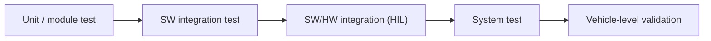

# Software Verification

MIL4 covers the **verification** of automotive software. The requirements
written in MIL3, the test cases designed there, and the HIL (Hardware-in-the-Loop)
rigs introduced in earlier modules all serve this discipline. This lesson
covers what verification proves, how it differs from validation, and the
deliverables a professional verification cycle must produce.

Verification answers one question: **"did we build the product right?"** Does
the software, as implemented, do what its specification says? An electronic
control unit (ECU) must pass this check before it reaches a vehicle.

## Verification vs. validation

Verification and validation are often confused, but they answer different
questions:

| | Verification | Validation |
|---|---|---|
| Question | Did we build it **right**? | Did we build the **right thing**? |
| Reference | Requirements and design specs | Real user / customer needs |
| Typical evidence | Test results vs. expected values | Behavior in the real vehicle/context |
| When | Continuously, at every V-model level | Late, on the integrated product |

In short: verification checks the software against its specification;
validation checks the product against real-world use. Both feed the two arms of the
[V-model](../../mil1/v-cycle/index.md): the left arm decomposes requirements
into design, and the right arm climbs back up through verification levels —
unit, integration, system — each one traced to the requirements level that
produced it.

## What gets verified, and at which level

Verification is not a single test at the end — it proceeds level by level:

Across these levels, two complementary techniques are used:

- **Static verification** — reviews, coding-standard checks (e.g. MISRA, the
  C/C++ safety guidelines used across the automotive industry), and static
  analysis. This finds defects *without executing the code* — cheap, fast, and
  applied before any dynamic test.
- **Dynamic verification** — actually running the software against test cases
  and comparing actual vs. expected outputs: on the PC (Model-in-the-Loop and
  Software-in-the-Loop), on the target processor (Processor-in-the-Loop), and
  on real hardware in the loop ([HIL](../../mil3/hil-users/index.md)).

Every dynamic test rests on the artifacts built in MIL3. The
[requirements](../../mil3/requirements/index.md)
define *what* must hold, and the [test cases](../../mil3/testcases/index.md)
define *how* each requirement is stimulated and checked. A verification
activity without requirement traceability proves nothing — an untraceable pass
is an observation, not evidence.

## What a verification cycle must deliver

A professional verification cycle does not end with an informal assessment —
it produces four concrete artifacts:

1. a **test specification** linked requirement-by-requirement,
2. an **executable test environment** based on automation rather than manual
   bench testing,
3. a **test report** with pass/fail verdicts and coverage,
4. **defect reports** for every deviation, fed back to development.

!!! note "Why this matters downstream"
    When a defect escapes verification, it resurfaces later as a field problem,
    where it is far more expensive to address. The remaining
    MIL4 lessons — [Validation](../validation/index.md),
    [Diagnosis Process](../diagnosis-process/index.md),
    [Troubleshooting](../troubleshooting/index.md) and
    [First Level Analysis](../first-level-analysis/index.md) — cover the
    detection and containment of exactly those escapes. Defects found during
    verification are the least expensive to fix.

!!! tip "How to work through MIL4"
    Take the lessons in order: **Verification → Validation → Diagnosis Process
    → Troubleshooting → First Level Analysis**. The first two cover
    demonstrating that the product works; the last three cover the workflow
    for investigating failures on HIL rigs and test vehicles.

!!! success "Key takeaways"
    - Verification checks conformance to specification; validation checks
      fitness for real use.
    - Verification follows the V-model levels: static checks first, then
      dynamic tests from MiL/SiL up to HIL, each traced back to requirements.
    - A test result without requirement traceability is an observation, not
      evidence.
    - A verification cycle must produce evidence: test specifications,
      automated test runs, reports, and defect tickets.

