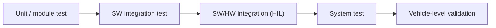

# Software Verification

Welcome to MIL4 — the module where all your earlier work pays off. The
requirements you wrote, the test cases you designed, the HIL (Hardware-in-the-Loop)
rigs you learned to drive: they all exist to serve one discipline —
**verification**. By the end of this lesson you'll be able to explain what
verification actually proves, tell it apart from validation without hesitation,
and name the deliverables a professional verification cycle must produce.

Verification answers one question: **"did we build the product right?"** Does
the software, as implemented, actually do what its specification says? Before
an electronic control unit (ECU) ever reaches a vehicle, someone has to prove
that — and in this module, that someone is you.

## Verification vs. validation: the classic trap

Every new engineer mixes these two up at least once, so let's settle it now.
They sound similar, but they answer different questions:

| | Verification | Validation |
|---|---|---|
| Question | Did we build it **right**? | Did we build the **right thing**? |
| Reference | Requirements and design specs | Real user / customer needs |
| Typical evidence | Test results vs. expected values | Behavior in the real vehicle/context |
| When | Continuously, at every V-model level | Late, on the integrated product |

Think of it this way: verification checks the software against the paperwork;
validation checks the product against reality. Both feed the two arms of the
[V-model](../../mil1/v-cycle/index.md): the left arm decomposes requirements
into design, and the right arm climbs back up through verification levels —
unit, integration, system — each one traced to the requirements level that
produced it.

## What gets verified, and at which level

Verification is not one big test at the end — it's a ladder you climb, level by
level:

Along that ladder you'll use two complementary techniques:

- **Static verification** — reviews, coding-standard checks (e.g. MISRA, the
  C/C++ safety guidelines used across the automotive industry), and static
  analysis. This finds defects *without executing the code* — cheap, fast, and
  your first line of defense.
- **Dynamic verification** — actually running the software against test cases
  and comparing actual vs. expected outputs: on the PC (Model-in-the-Loop and
  Software-in-the-Loop), on the target processor (Processor-in-the-Loop), and
  on real hardware in the loop ([HIL](../../mil3/hil-users/index.md)).

Here's the mindset rule to internalize early: every dynamic test rests on the
artifacts you built in MIL3. The [requirements](../../mil3/requirements/index.md)
define *what* must hold, and the [test cases](../../mil3/testcases/index.md)
define *how* each requirement is stimulated and checked. A verification
activity without requirement traceability proves nothing — an untraceable pass
is just an observation, not evidence.

## What a verification cycle must deliver

When you run a professional verification cycle, you don't come back with "looks
good to me." You come back with four concrete artifacts:

1. a **test specification** linked requirement-by-requirement,
2. an **executable test environment** — automation, not manual poking at a
   bench,
3. a **test report** with pass/fail verdicts and coverage,
4. **defect reports** for every deviation, fed back to development.

!!! note "Why this matters downstream"
    When a defect escapes verification, it resurfaces later as a field problem
    — expensive, embarrassing, and suddenly everyone's problem. The remaining
    MIL4 lessons — [Validation](../validation/index.md),
    [Diagnosis Process](../diagnosis-process/index.md),
    [Troubleshooting](../troubleshooting/index.md) and
    [First Level Analysis](../first-level-analysis/index.md) — are about
    catching and containing exactly those escapes. Solid verification is the
    cheapest defect filter in the whole chain.

!!! tip "How to work through MIL4"
    Take the lessons in order: **Verification → Validation → Diagnosis Process
    → Troubleshooting → First Level Analysis**. The first two build the
    "prove it works" mindset; the last three build the "find out why it
    doesn't" workflow you will use daily on HIL rigs and test vehicles.

!!! success "Key takeaways"
    - Verification = conformance to specification; validation = fitness for
      real use. You can now tell them apart — many engineers can't.
    - Verification climbs the V-model ladder: static checks first, then
      dynamic tests from MiL/SiL up to HIL, always traced back to requirements.
    - No traceability, no proof — an untraceable pass is just an observation.
    - Your job is to produce evidence: test specs, automated runs, reports and
      defect tickets — never opinions.

